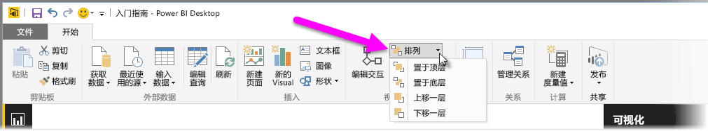
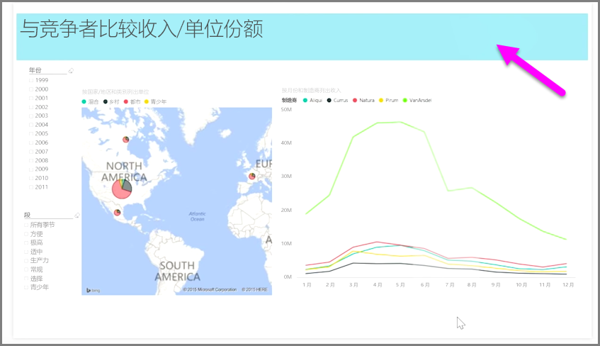

当报表上存在大量元素时，Power BI 使你能够管理它们彼此重叠的方式。 项目的分层方式，或者在其他项目上面的排列方式，常常被称为 Z 顺序。

若要管理报表中的元素的 Z 顺序，请选择某个元素，并使用功能区的**开始**选项卡上的**排列**按钮更改其 Z 顺序。

通过使用**排列**按钮菜单中的选项，你可以以你想要的方式获取报表中的元素顺序。 你可以将视觉对象向前或向后移动一层，或者将其直接发送至顺序的前端和后端。

当使用形状作为修饰性背景或边框或者突出显示单个图表或图形的特定部分时，使用“排列”按钮尤其有用。 你还可以使用它们来创建背景，比如下面用于报表标题背景的浅蓝色矩形。

