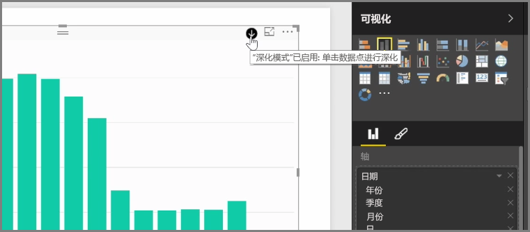
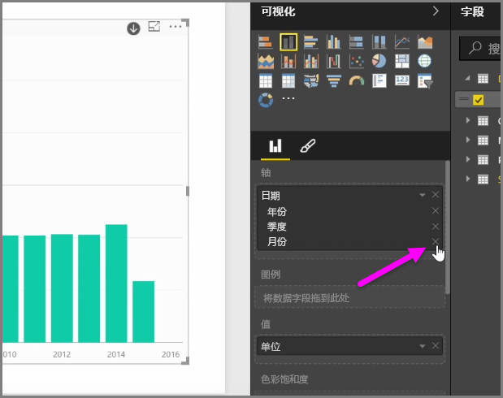
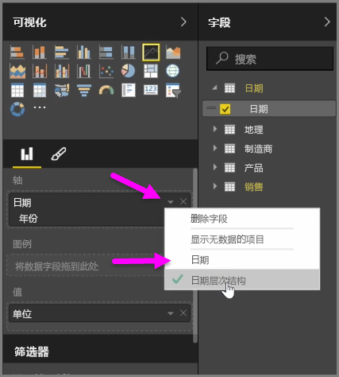
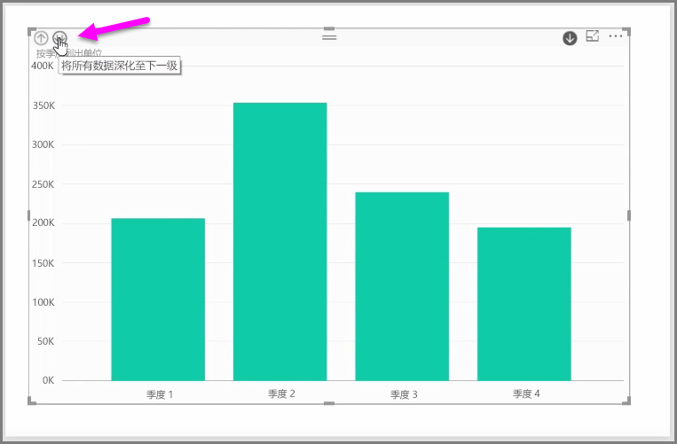

当你将 *日期* 字段添加到 *轴* 字段存储桶的视觉对象中时，Power BI 会自动添加时间层次结构，其中包括 *年* 、 *季度* 、 *月* 和 *天* 。 通过执行此操作，让用户向下钻取这些不同的时间级别，Power BI 可使你的视觉对象与查看你报表的用户进行基于时间的交互。

利用就地层次结构，你可以开始向下钻取这些不同的时间层次结构。 例如，单击某一年将向下钻取到层次结构中下一层次，在这种情况中， *季度* 将会随后显示在视觉对象中。

在自动创建的层次结构中，你还可以管理共享的报表允许用户向下钻取到的具体级别。 若要进行此操作，在可视化窗格中，只需单击你想要删除的层次结构旁边的 X 即可。 已删除的级别将从报表中删除，向下钻取将不再显示该级别。

如果你需要先获取该级别的层次结构，只需删除 *日期* 字段，并再次从 **字段** 窗格中添加，就会自动再次生成层次结构。

可能有时你并不想将层次结构用于视觉对象。 为此，你可以通过选择 *日期* 字段（前提是你已将其添加到视觉对象）旁的向下箭头按钮来控制该操作，然后选择 **日期** 而不是 **日期层次结构** 。 这将提示 Power BI 在视觉对象中显示原始日期值。

你也可以同时展开当前可见的所有数据元素，而不用选择单个季度或单一年份。 若要执行该操作，请选择视觉对象左上角的 *钻取全部* 图标。这是一个双向下箭头图标。

