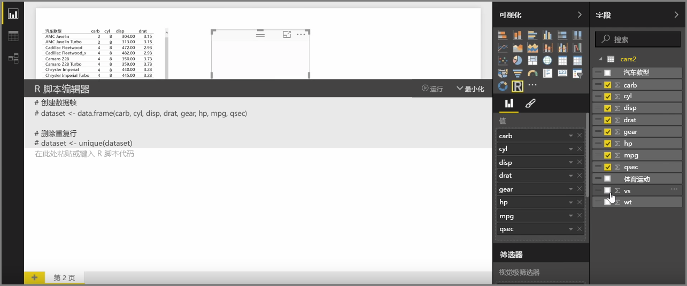
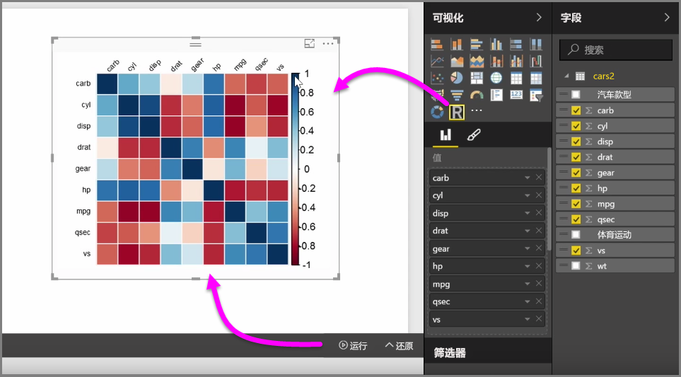
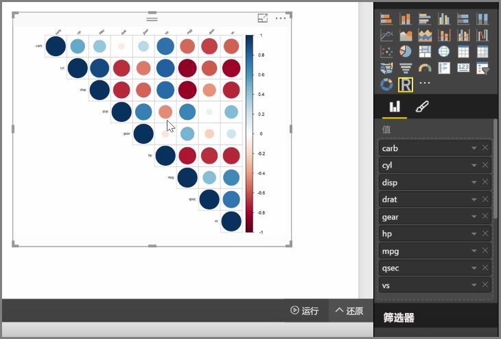

使用 Power BI Desktop，你可以执行解析和统计分析并通过集成 R 来创建引人注目的视觉对象。你可以在 Power BI Desktop 报表内托管这些 R 可视化效果。

你在**可视化效果**窗格中选择 **R 视觉对象**图标时，Power BI 将在画布上创建一个占位符来承载你的 R 视觉对象，然后直接在该画布上提供一个 R 脚本编辑器供你使用。 在你将字段添加到 R 视觉对象时，Power BI Desktop 会将它们添加到 R 脚本编辑器窗格。

在 R 脚本编辑器中 Power BI 所生成内容的下方，你可以开始创建用于生成视觉对象的 R 脚本。 脚本创建完成后，请选择**运行**，然后将发生以下情况：

1. 添加到视觉对象的数据（从**字段**窗格）将从 Power BI Desktop 发送到 R 的本地安装
2. 在 Power BI Desktop R 脚本编辑器中创建的脚本将在 R 的本地安装上运行
3. 然后 Power BI Desktop 从 R 安装反过来获取一个视觉对象，并将其显示在画布上

这一切发生得相当快，结果将显示在画布上的 **R 视觉对象**可视化效果中。

你可以通过调整 R 脚本并再次选择**运行**来更改 R 视觉对象。 在下图中，我们将视觉对象更改为显示圆圈而不是正方形。

R 视觉对象跟 Power BI Desktop 中的任何其他视觉对象一样，因此你可以在画布上与其进行交互并建立与其他视觉对象的连接。 当你通过筛选或突出显示在画布上与其他视觉对象进行交互时，R 视觉对象将像其他任何 Power BI 视觉对象一样自动作出反应，而无需调整 R 脚本。

在 Power BI Desktop 中直接使用是利用 R 的强大功能的一种绝佳方法。

## 后续步骤
**祝贺你！** 你已经完成了 Power BI **引导学习** 课程的**可视化**部分。 现在，你可以认为自己已精通 Power BI 中提供的众多可视化效果，并了解如何对其进行使用、修改和自定义。 好消息：可视化效果在 Power BI Desktop 和 Power BI 服务中本质相同，因此你所学知识适用于这二者。

现在你可以开始了解云并享受 Power BI 服务了，在其中你可以**浏览数据**。 如你所知，工作流如下所示：

* 将数据导入 **Power BI Desktop**，然后创建报表。
* 发布到 Power BI 服务，你可在该服务中创建新的**可视化效果**和构建仪表板
* 与他人（尤其是差旅人员）**共享**你的仪表板
* 在 **Power BI Mobile** 应用中查看共享仪表板和报表并与其交互

无论你创建报表还是仅查看报表并与其交互，现在你已了解如何创建所有这些精美的视觉对象，以及如何将其连接到数据。 接下来，我们将在操作中查看这些视觉对象和报表。

下一部分见！

