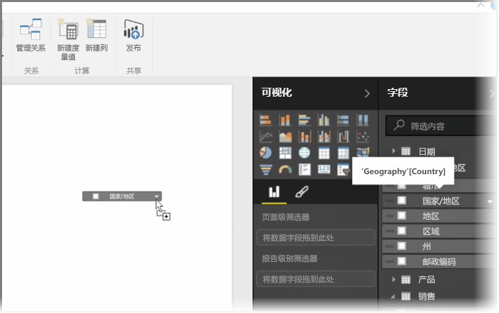
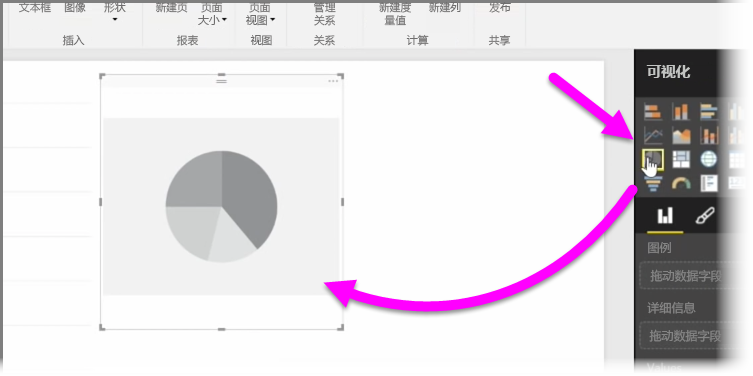
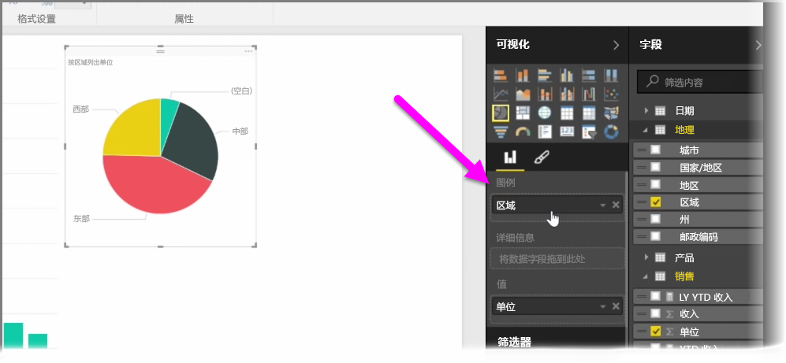
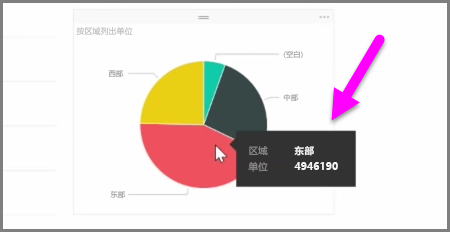
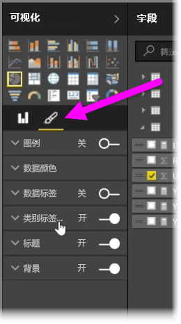

在本文中，你将了解如何创建新的条形图、饼图和树状图，并自定义它们以适应你的报表。

在 Power BI Desktop 中有两种不同的方式来创建新的可视化效果：

* 你可以从**字段**窗格中拖动字段名称，并将它们放在报表画布上。 默认情况下，你的可视化效果显示为数据表。
  
  
* 你也可以在**可视化效果**窗格中单击想要创建的可视化效果类型。 如果使用此方法，默认的视觉对象则是类似于你所选的视觉对象类型的空白占位符。
  
  

在你创建了图形、映射或图表后，便可以开始将数据字段拖动到**可视化效果**窗格的下半部分以生成和组织你的视觉对象。 可用字段将基于你所选择的可视化效果的类型而进行更改。 当你拖放数据字段时，你的可视化效果将自动更新以反映相应的更改。

可通过选中你的可视化效果，然后将句柄拖进或拖出来重设可视化效果的大小。还可以通过单击和拖动可视化效果将其移到画布上的任意位置。 如果你想要在不同类型的可视化效果之间进行转换，请选择你想要更改的视觉对象，接着只需从**可视化效果**窗格中的图标选择其他的视觉对象即可。 Power BI 尝试将所选的字段尽可能地转换为新的视觉对象类型。

当鼠标悬停在可视化效果的某些部分时，你将获得工具提示，其中包含有关该细分市场的详细信息，如标签和总值。

选择**可视化效果**窗格上的**画笔**图标，以对你的可视对象进行外观上的更改，例如背景对齐方式、标题文本和数据颜色。

对你的视觉对象进行外观上的更改的可用选项根据你所选的视觉对象类型而变化。

