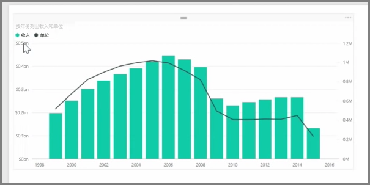
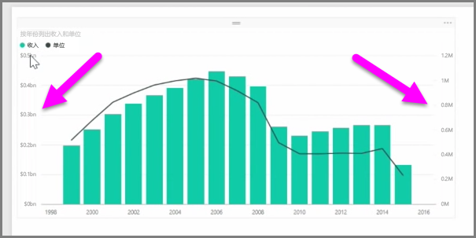
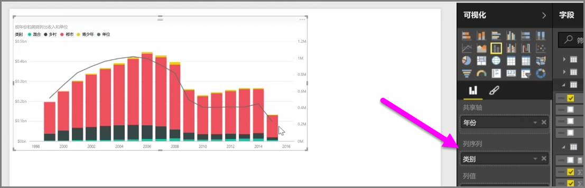

如果想要对两个具有不同比例的度量值（例如收入和单位）进行可视化，显示折线和具有不同轴刻度的条形图的**组合图表**将非常有用。 默认情况下，Power BI 支持许多不同类型的组合图表，包括常用的**折线图**和**堆积柱形图**图表。

创建组合图表时，将为你提供**共享轴**（X- 轴）的字段，然后提供两个字段（这一情况下，是柱形图和折线图）的值。 两个 Y 轴图例显示在可视化效果的两侧。

你还可以通过将一个类别拖到“可视化效果”窗格中的“列序列”字段，按类别拆分每一列。 进行这一操作的时候，条形图的每个柱均基于每一类别内的值，按比例着色。

组合图表是在单个可视化效果中，对多个具有不同比例的度量值进行可视化的有效方法。

