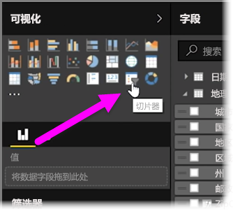
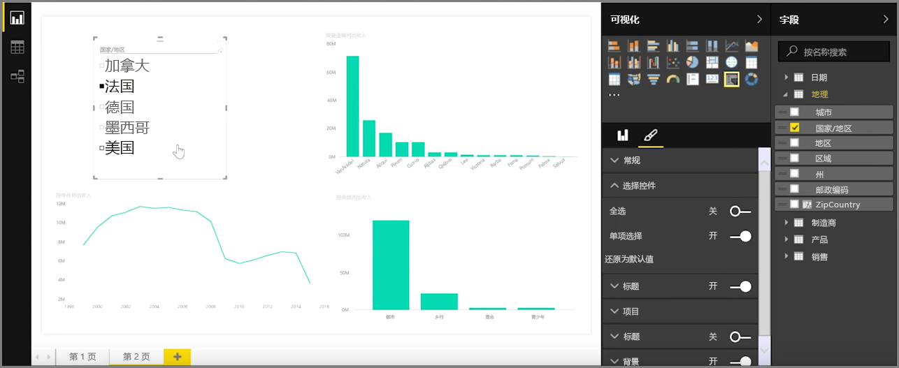
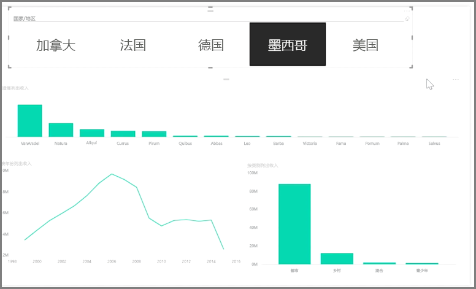

切片器是一种功能强大的可视化效果，尤其是它可作为繁重报表的一部分。 **切片器**是 **Power BI Desktop** 中的一种画布内视觉筛选器，查看报表的任何用户都可使用它按年份或地理位置等特定值来分割数据。

若要向报表添加切片器，请从**可视化效果**窗格中选择**切片器**。

拖动想要用作切片依据的字段，并将其放置到切片器占位符上。 可视化效果将变为带复选框的元素列表。 这些元素就是筛选器 - 选择元素旁的复选框进行分割，即可选择对同一报表页上的所有其他可视化效果进行筛选或 *切片* 。

可将切片器设置为几种不同格式。 你可以将其设置为同时接受多个输入，或切换到**单选**模式以便每次使用一个输入。 还可向切片器元素添加**全选**选项，此选项在列表很长时会有帮助。 将切片器方向从默认的垂直改为水平，更改后它将变为选项栏而非清单。

