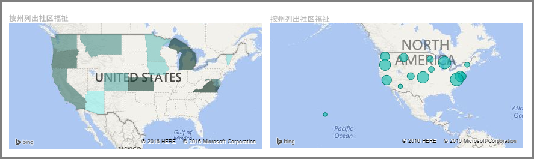
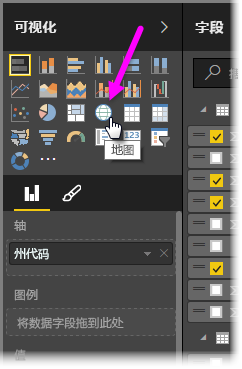
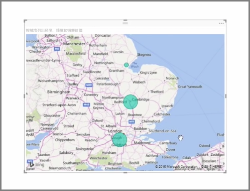
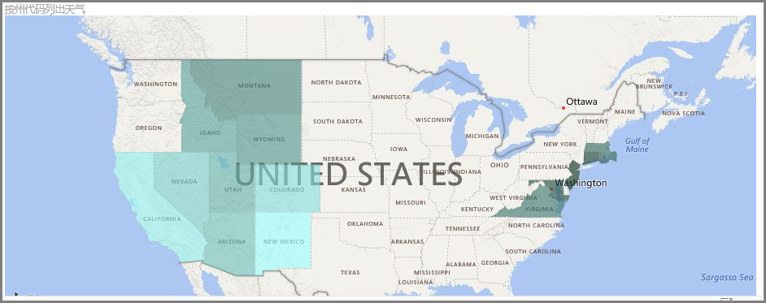
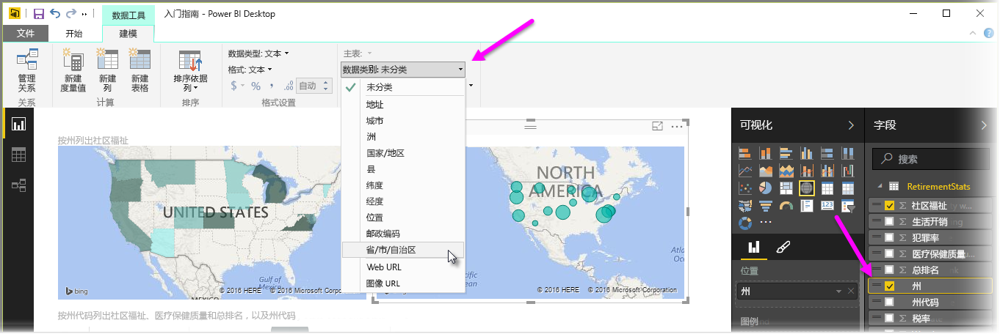

Power BI 具有两种不同类型的地图可视化效果：在地理点上方添加气泡的气泡图，以及实际展示你想要进行可视化的区域的轮廓的形状图。

> [!NOTE]
> 处理国家或地区时，请使用三字母缩写，以确保地理编码可以在地图可视化效果中正常运行。 不要使用两字母缩写，因为这样可能无法正确识别某些国家或地区。
> 如果只有两字母缩写，请参阅[这篇外部博文](https://blog.ailon.org/how-to-display-2-letter-country-data-on-a-power-bi-map-85fc738497d6#.yudauacxp)，了解将两字母国家/地区缩写与三字母国家/地区缩写相关联的具体步骤。
> 
> 

## 创建气泡图
若要创建气泡图，请在**可视化效果**窗格上选择**地图**选项。 必须将一个值添加到**可视化效果**选项中的位置存储桶，以使用地图视觉对象。

Power BI 能灵活接受各种位置值类型（上到较为常规的详细信息，例如城市名称或机场代码，下到非常具体的纬度和经度数据）。 向“大小”Bucket 添加字段，以相应地更改每个地图位置的气泡大小。

## 创建形状图
若要创建形状图，请在“可视化效果”窗格中选择**着色地图**选项。 就像气泡图一样，必须将某种类型的值添加到“位置”存储桶，以使用此视觉对象。 向“大小”Bucket 添加字段，以相应地更改填充颜色的浓度。

视觉对象左上角中的警告图标指示该地图需要更多的位置数据以准确地绘制值。 位置字段中的数据不明确时，这是一个特别常见的问题，例如，使用类似华盛顿这样可以表示一个州或一个区的区域名称。 解决此问题的一种方法是重命名列，使其更具体，例如州。 解决这一问题的另一个方法是通过选择“建模”选项卡中的**数据类别**，手动重置数据类别。从这里，你可以向数据分配一个类别，如“州”或“城市”。

