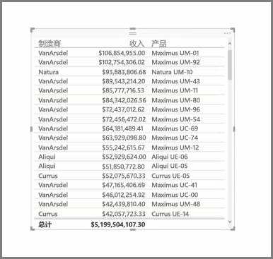
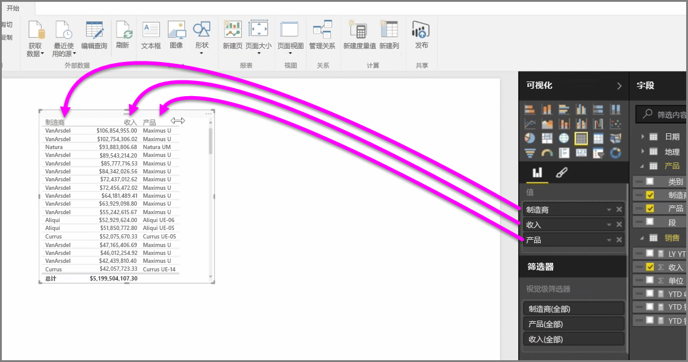
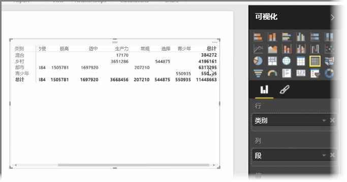

除了支持大量图表外，Power BI Desktop 还支持许多表格式可视化效果。 在实际操作中，当你获取分类字段或文本字段并将其拖动到报表画布时，默认情况下你会获得一张结果表。 你可以向上或向下滚动浏览表，初始情况下它会按字母顺序排序。

如果表中有数字信息，例如收入，总金额将会显示在底部。 你可以通过单击其标题来切换升序或降序的顺序，以按列进行手动排序。 如果列的宽度不足以显示其全部内容，单击并拖动侧向的标题可增大列宽。

**可视化效果**窗格中值存储桶中的字段顺序决定了它们在表内的显示顺序。

**矩阵**与表类似，但它在行和列上具有不同的类别标题。 与表一样，数字信息会自动在矩阵的底部和右侧自动汇总。

有许多修饰选项可用于矩阵，例如自动调整列宽大小、切换行和列总计数、设置颜色以及更多操作。 创建矩阵时，请确保分类数据（非数字数据）位于矩阵左侧，数字文件位于右侧，以确保出现水平滚动条，并且滚动条可正常工作。

