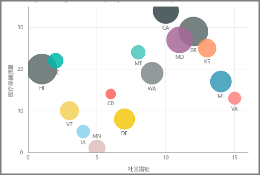
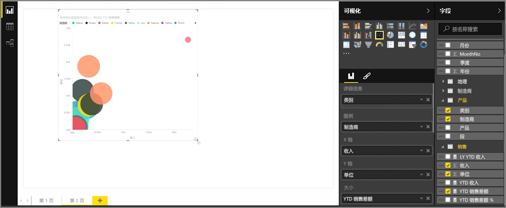
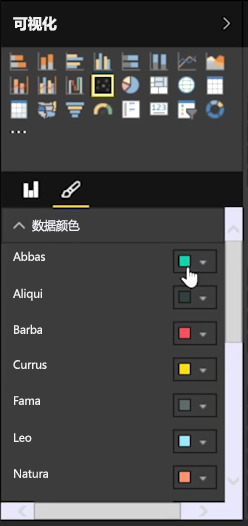
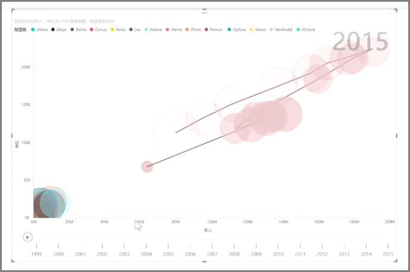

如果想要比较两个不同的度量值，例如单位销售额和收入，常见的可视化效果就是使用散点图。

若要创建空白图表，请在**可视化效果**窗格中选择**散点图**。 从**字段**窗格中将你想要进行比较的两个字段拖放到 X 轴和 Y 轴选项存储桶。 到这里，你的散点图可能仅仅在视觉对象中心拥有小小的气泡 - 你需要将度量值添加到详细信息存储桶，以指示希望如何分割你的数据。 例如，如果你正在比较物料销售额和收入，建议按类别、制造商或销售月份拆分数据。

将其他字段添加到图例存储桶，以便根据字段的值对气泡进行颜色编码。 你还可以向大小存储桶中添加字段，以按照该值更改气泡大小。

散点图也有许多视觉对象格式设置选项，例如，打开每个彩色气泡的轮廓线和切换单个标签。 你也可以为其他图表类型更改数据颜色。

通过将基于时间的字段添加到播放轴存储桶，你可以创建气泡图随时间推移发生变化的动画。 在动画播放期间，单击气泡可查看其路径轨迹。

>[!NOTE]
>请注意，如果在散点图中只看到一个气泡，是因为 Power BI 正在聚合数据。这是默认行为。 在**可视化效果**窗格中，向详细信息存储桶添加类别以获取更多气泡。
> 
> 

