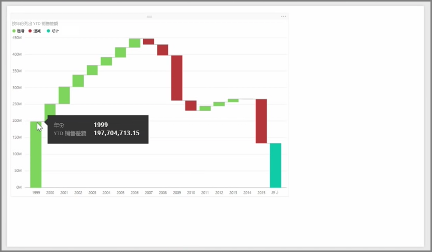
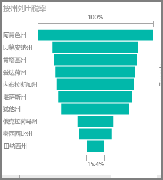

瀑布图和漏斗图是 Power BI 中包含的两种更加有趣（可能不常见）的标准可视化效果。 若要创建任一类型的空白图表，请在**可视化效果**窗格中选择其图标。

**瀑布图**通常用于显示特定值随时间的更改。

瀑布图仅有两个存储桶选项：类别和 Y 轴。 将基于时间的字段（例如年份）拖动到类别存储桶，并将你想跟踪的值拖动到 Y 轴存储桶。 默认情况下，值有所增加的时间段会显示为绿色，而值有所减少的时间段会显示为红色。

**漏斗图**通常用于显示随特定过程的更改，例如销售管道或网站保留工作。

**瀑布图**和**漏斗图**两者都可以进行分隔和自定义可视化效果。

