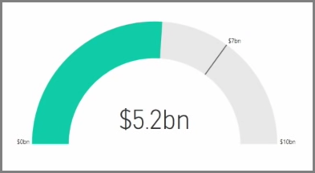
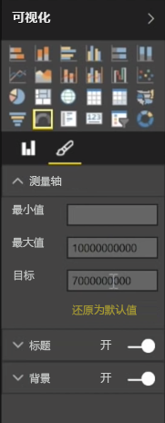
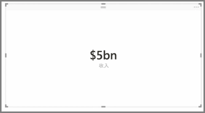
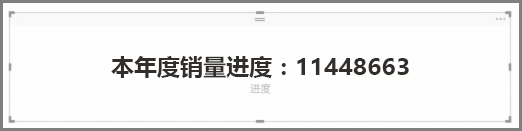

通常情况下，可视化效果用于比较两个或多个不同值。 但是，有时生成报表时，你可能希望仅跟踪一个关键绩效指标 (KPI) 或度量值随着时间推移的变化。 若要在 Power BI Desktop 中执行此操作，方法是使用**仪表**或**单数字**卡片视觉对象。 若要创建任一类型的空白图表，请在**可视化效果**窗格中选择其图标。

当要构建仪表板，并且想要显示特定目标的进展时，仪表将特别有用。 若要创建仪表，在**可视化效果**窗格中选择其图标，然后将要跟踪的字段拖动到值存储桶。

默认情况下，仪表将以 50%，或值的双倍显示，并且有两种方法来调整此设置。 若要以动态方式设置值，请将字段拖动到最小、最大和目标值存储桶。 或者，使用视觉对象格式化选项来手动自定义你的仪表范围。

卡片可视化效果只是显示字段的数字表示形式。 默认情况下，卡片视觉对象使用显示单位来使数字简短，例如显示“50 亿美元”而不是“5,000,000,000 美元”。 使用视觉对象格式化选项来更改使用的单位或彻底禁用它。

一个有趣卡片应用程序是让其显示已与文本串联的自定义度量值。 若要使用较早的示例，借助自定义度量值，你的卡片可以包括高级 DAX 函数并显示类似“本年总税收：50 亿美元”或“本年度单位销售进度：”的内容，然后添加表示进度的数字。

