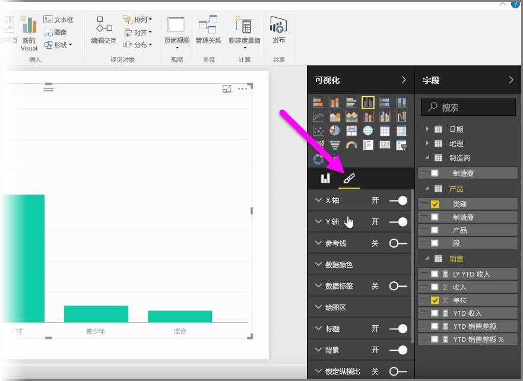
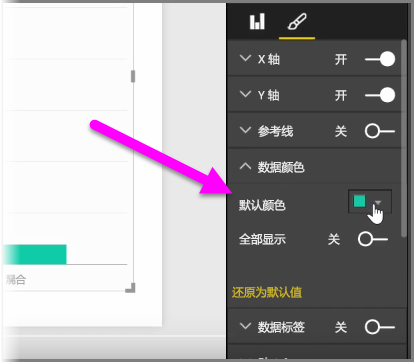
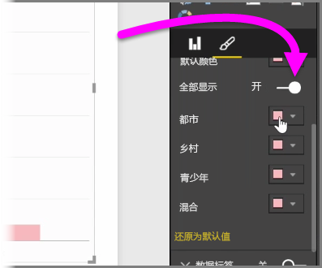
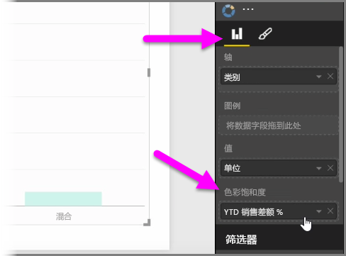
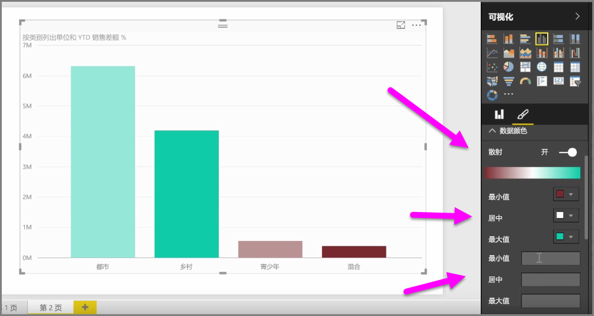
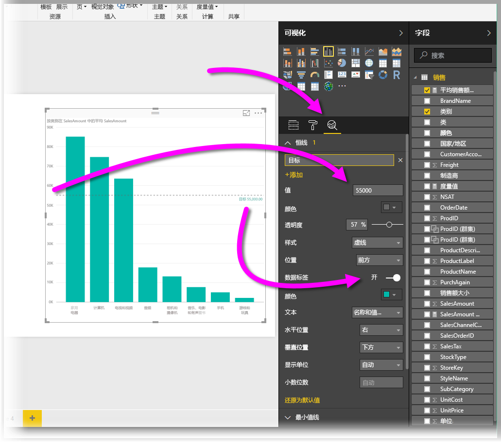
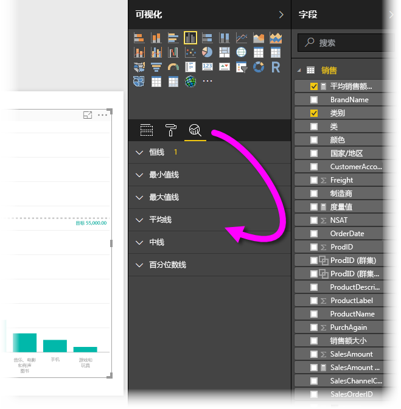

很多时候，你可能想要修改在图表或视觉对象中使用的颜色。 Power BI 为你提供了有关颜色显示方式的大量控件。 若要开始，选择视觉对象，然后在**可视化效果**窗格中，单击**画笔**图标。

有很多用于更改视觉对象的颜色或格式设置的选项。 你可以通过选择**默认颜色**旁边的颜色选取器，然后选择你所选择的颜色，来更改视觉对象的所有条形的颜色。

还可以通过将**全部显示**滑块切换到“on”来更改每个条形（或其他元素，取决于你选择的视觉对象类型）的颜色。 执行操作时，每个元素都会显示颜色选择器。

还可以基于某个值或度量值更改颜色。 若要执行该操作，请将字段拖动到可视化效果窗格（请注意此窗格在**字段框**分区而不是在**画笔**分区中可用）中的**颜色饱和度**存储桶中。

此外，你可以更改填充数据元素颜色时所用的色阶和颜色。 你还可以通过将散射滑块切换到“on”来选择散射规模，这允许在三种颜色之间进行扩展。 并且你还可以设置显示在图表上的 *最小* 、 *中间* 和 *最大* 值。

你还可以使用这些值创建规则，例如，将大于零的值设为一种颜色，小于零的值设为另一种颜色。

使用颜色的另一便捷工具是设置恒线（有时亦称为“参考线”）。 可以设置恒线的值和颜色，甚至可以让参考线包含标签。 若要创建恒线（以及其他相关线），请选择“分析”窗格（形似放大镜），再展开“参考线”部分。

可以为视觉对象创建其他许多线（也是在“分析”窗格中执行操作），如“最小值线”、“最大值线”、“平均值线”、“中值线”和“百分位数线”。

最后，你可以创建单个视觉对象的边框，并且与其他控件一样，你还可以指定边框的颜色。

