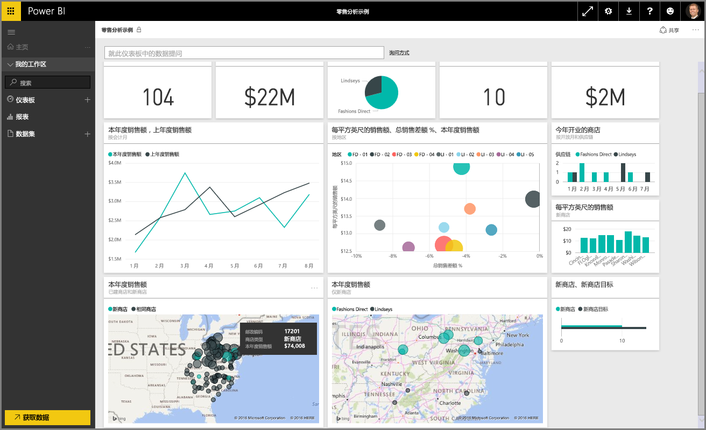
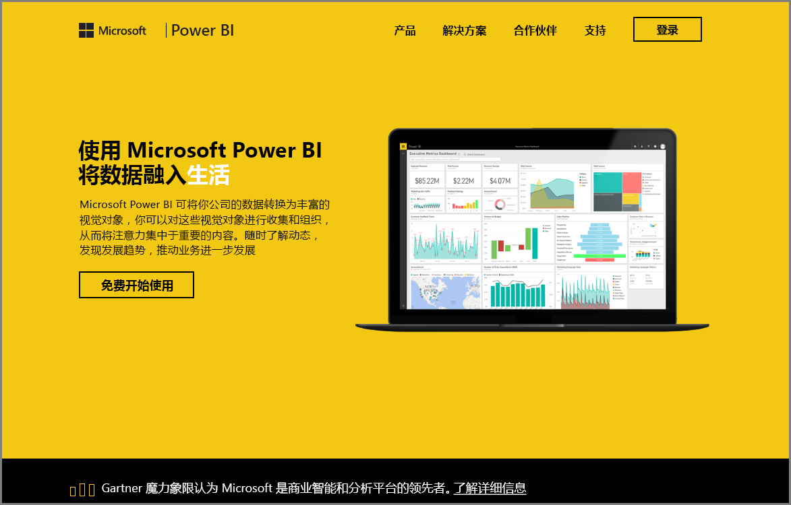

欢迎进入 Power BI **引导学习**课程的**研究数据**部分。 既然你已经了解了 Power BI Desktop，以及如何获取数据并让数据呈现可视化效果，那么你已准备好在 Power BI 服务中研究数据。

在本部分中你要了解各种知识，并且积极的互动和进行 Power BI 共享在这一部分至关重要。 准备好开始这迷人而有趣的部分吧。

## Power BI 服务简介
*了解 Power BI 服务能为你的组织提供哪些服务*

Power BI 服务是 **Power BI Desktop** 的自然扩展，其功能包括上传报表、创建仪表板，以及使用自然语言对数据进行提问。 该服务可用于设置数据刷新时间、与组织共享数据并创建自定义服务包。

在以下主题中，我们将研究 Power BI 服务，并展示如何使用 Power BI 服务将商业智能数据转换为数据理解，并创建可协作的决策驱动环境。

