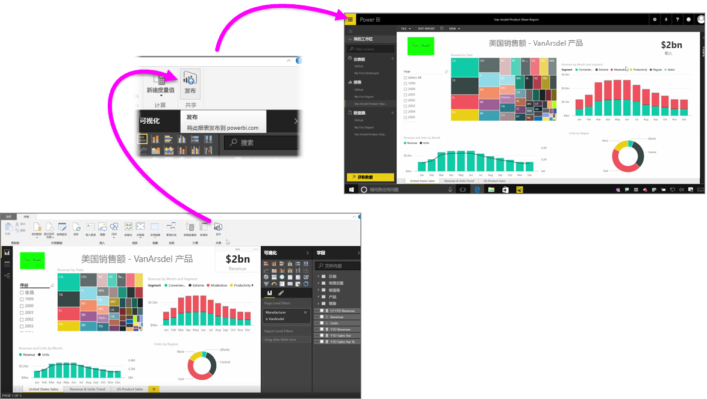

将报表发布到 Power BI 服务既快捷又方便。

在 **Power BI Desktop** 中完成报表创作后，只需选择 Power BI Desktop 中的**主页**选项卡上的**发布**按钮，即可开始该过程。

你的报表和数据（包括可视化效果、查询和自定义度量值）将一起打包并上传到 Power BI 服务。

> 注意：Power BI Desktop 报表常称为 **.pbix** 文件（Windows 中为其提供的扩展名）。
> 
> 

上传完成后，对话框将提示你发布进程已成功，并在该对话框中提供一个链接，在 Web 浏览器中将你直接转到 Power BI 服务中的报表。

就是这么简单，你可以轻松将报表从 Power BI Desktop 发布到 Power BI 服务。

