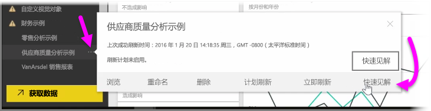
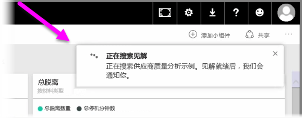
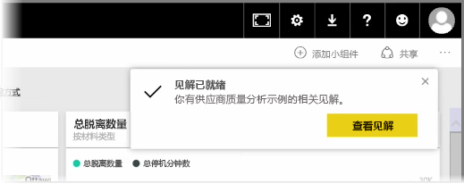
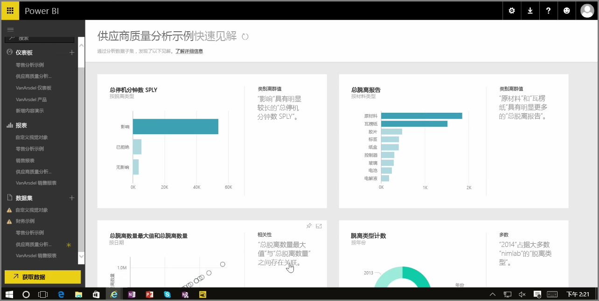

处理 Power BI 服务中的仪表板、报表或数据集时，可让 Power BI 对数据进行快速深入分析。 在 Power BI 中，从左侧窗格中的**数据集**部分，选择你感兴趣的数据集旁边的省略号（三个点）。 将显示选项菜单，并在最右显示名为**快速见解**的选项。

当你选择“快速见解”时，Power BI 将进行机器学习并搜索数据，对它进行分析以获取快速见解。 服务的右上角将显示通知，指示 Power BI 正在查找见解。

大约十五秒后，通知将改为告知你 Power BI 找到了一些见解。

当你选择通知上的**查看见解**按钮时，将显示一页视觉对象，该页显示 Power BI 找到的见解，如下图中所示。 可向下滚动页面以查看和考虑找到的大量见解。

像其他任何视觉对象一样，你可以与“快速见解”页中的视觉对象进行交互，还可将其中任意视觉对象固定到已有仪表板，或根据需要进一步筛选其中一个或多个视觉对象，以便搜索有待探究和发现的其他见解。

凭借**快速见解**，你可以让 Power BI 发现数据中的离群值和趋势，然后在仪表板中使用这些发现，或进一步精炼和筛选它们以获得对你来说最重要的见解。

