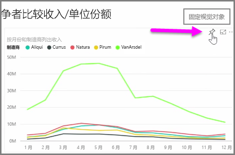
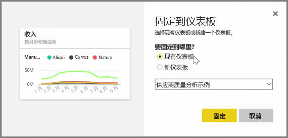
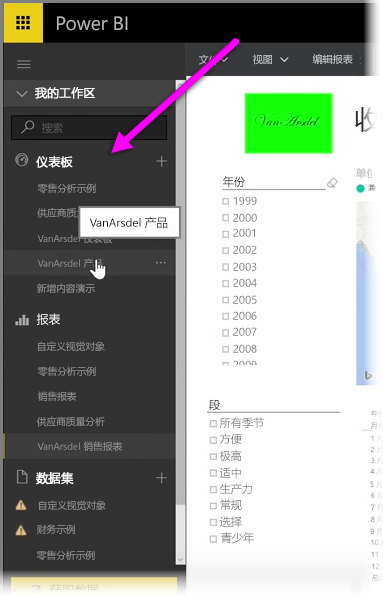
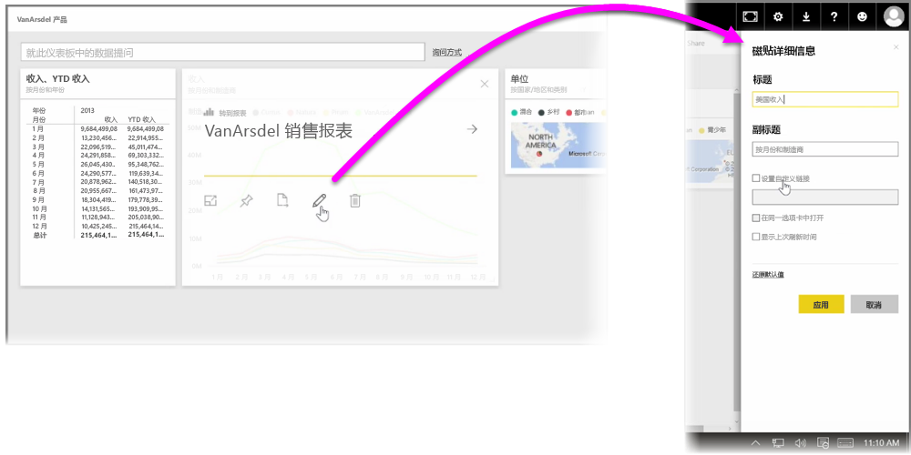

Power BI 中的**仪表板**是在 Power BI 服务内创建的单页的可视化效果集合。 通过**固定**使用 Power BI Desktop 创作和发布的报表的可视化效果，或者在 Power BI 服务内创建的可视化效果来创建仪表板。 将可视化效果**固定**到仪表板就如同将图片固定到墙上的软木板 - 将可视化效果固定在此处的某个特定点上，供他人观看。 要固定可视化效果，请在 Power BI 服务上打开其报表。 将鼠标悬停在想要固定的可视化效果上方，然后选择**固定**图标。

此时会出现一个对话框，你可以在对话框的下拉菜单中选择可视化效果的目标仪表板，或者创建新的仪表板。 你还可以预览已固定的可视化效果在仪表板中的呈现效果。 你可以将多个报表和页面的可视化效果固定到一个仪表板，将不同的数据集和源合并到一个页面中。

在**仪表板**上，可以通过对其进行“固定”添加任何类型的可视化效果，包括图形、地图、图像和形状等。 将可视化效果固定到仪表板后，则该可视化效果就称为**磁贴**。

你的仪表板（包括任何新的仪表板）将显示在 Power BI 服务左侧的仪表板部分中。 从列表中选择一个仪表板进行查看。

你可以随意更改仪表板上的可视化效果的布局。 若要调整磁贴的大小，请将其图柄拖入或拖出。若要移动磁贴，只需单击并将其拖动到仪表板上的另一位置即可。 将鼠标悬停在磁贴上方，然后单击**铅笔**图标以打开**磁贴详细信息**，你可以在其中更改**标题**或**副标题**。

单击仪表板磁贴以查看生成该磁贴的报表。 这样可以快速查看可视化效果背后的基础数据。 你还可以通过使用**磁贴详细信息**中的**设置自定义链接**来更改该链接。

你可以将一个仪表板中的磁贴固定到另一个仪表板，例如，如果你有一系列仪表板，并且希望创建一个汇总仪表板。 创建流程相同：将鼠标悬停在磁贴上方，然后选择**固定图标**。 创建和更改仪表板很容易。 并且，你可以自定义仪表板，使单页仪表板准确显示其应显示的内容。

