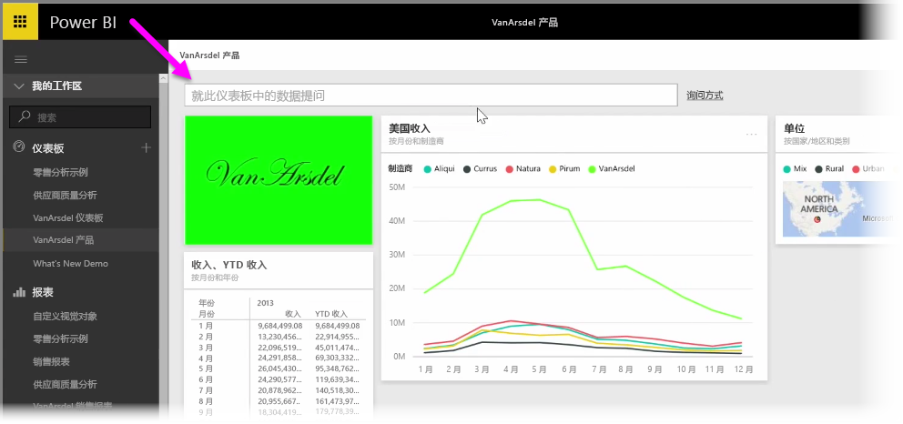
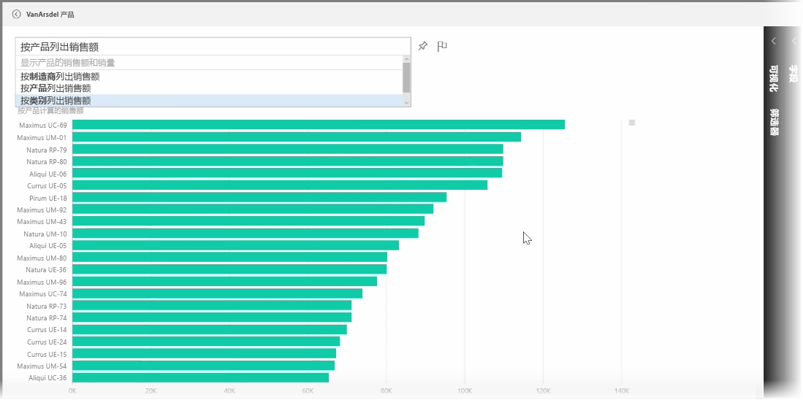

Power BI 附带了一个功能强大的语言识别引擎，允许你使用对话性短句和问题提出有关数据的问题。 因此除了使用 Power BI 生成报表和可视化之外，你仅通过询问简单的问题即可创建图表和图形。

要提出有关数据的问题，请在 Power BI 中打开仪表板，屏幕顶部将显示输入框，你可以在其中提出有关所显示数据的问题。 此功能有时称为 *问题与解答* ，更多时候简称 **问答** 。

当你单击此框时，Power BI 将显示提示，其中包含以据你的数据（如“YTD 收入”）为基础的建议条件。 你可以单击建议条件以查看结果，结果通常显示为简单的表个或卡片。 当你选择某一建议短语时，Power BI 将根据你的选择实时自动创建视觉对象。

还可以使用自然语言提问，如“我们去年的收入是多少？” 或者“2014 年 3 月哪种产品销量最高？”。 Power BI 将显示它对你的问题的理解，并选择最佳的视觉类型来表示答案。 正如 Power BI 中的其他任何视觉对象，你可以通过选择**固定**图标将它**固定**到你选择的仪表板。

此过程中的任何时刻，你都可以编辑由你的自然语言问题或短句创建的视觉对象。 使用屏幕右侧的**可视化效果**和**字段**窗格即可。 像 Power BI 中的其他任何视觉对象一样，你可以改变布局、调整筛选器和更改字段输入。

若要在创建最佳视觉对象后将可视化效果保存到仪表板，选择问题输入框旁边的**固定**图标即可。

