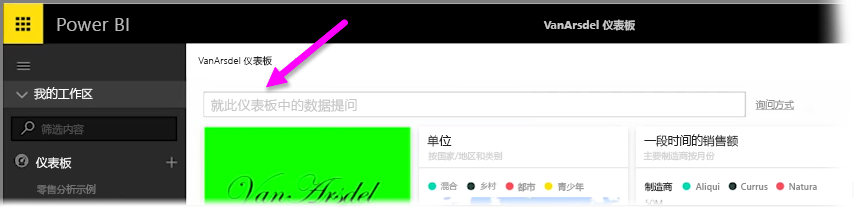
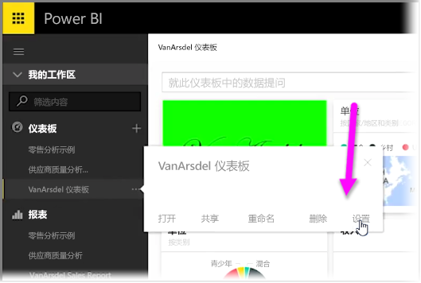
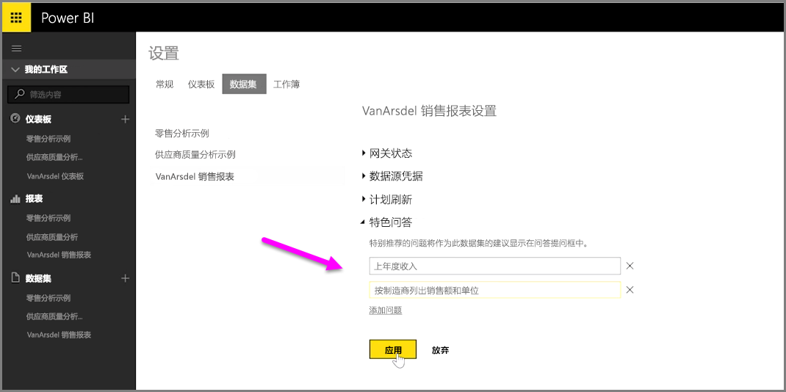

借助 Power BI，可以添加你为使用仪表板自然语言查询框（通常称为**问答**框）的其他用户提供的建议问题。 用户单击仪表板顶部的输入框时，就会看到这些建议问题。

若要添加你自己的问题，请选择你想要使用的仪表板的名称旁边的省略号（三个点...），然后从菜单中选择**设置**。

 这一操作将打开仪表板的**设置**页以及基础数据集或工作簿。 你可以从**设置**页上的**仪表板**部分彻底禁用问答搜索输入框，但是我们想要添加问题，因此我们选择**数据集**部分。

在**数据集**部分中，将显示与仪表板相关联的所有数据集。 从列表中选择与仪表板相关联的数据集，选择**特别推荐问答问题**，然后选择**添加问题**链接。 将你的问题或提示输入在输入框中，然后选择**应用**。

现在，当有人在任意时间单击所选仪表板上的搜索输入框时，他们将在顶部的提示列表中看到你所建议的条目，并且选择该问题会将其直接转到该问答的答案。 这是让仪表板用户思考可用数据类型以及如何将其充分利用的重要方式。

