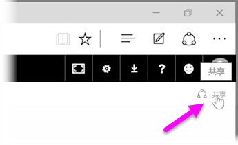
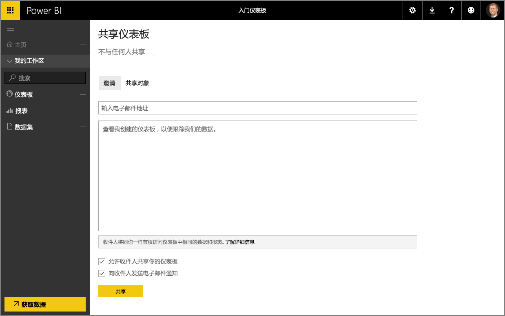

我们已经了解了 Power BI 如何帮助你找到数据，如何在数据模型中收集数据以及如何使用该数据生成报表和可视化效果。 我们还了解了如何将这些报表发布到 Power BI 服务，以及如何创建仪表板，帮助你监视随时而变的信息。 当你在组织中与他人共享你的见解时，所有这些功能会更加强大。 幸运的是，共享仪表板非常简单。

若要共享仪表板，在 Power BI 服务中打开它，然后选择右上角的**共享**链接。

此时将出现**共享仪表板**页，你可以在其中选择**邀请**分区，然后使用你想要授予其访问仪表板权限的联系人填写**电子邮件地址**输入框。 当使用域和 Office 365 域中的帐户键入电子邮件地址时，Power BI 将检查电子邮件地址并在可能的时候自动完成。 你还可以将电子邮件地址复制粘贴进此框，或使用通讯组列表、安全性组或 Office 365 组以立刻联系多个联系人。

如果你选择了复选框（底部附近）以 *向收件人发送电子邮件通知* ，然后收件人会收到一封电子邮件，告知他们你与其分享了仪表板，其中包含仪表板的链接。 你可以将注释添加到他们将收到的电子邮件，或发送 Power BI 为你创建的注释（就在你输入其电子邮件地址的位置下方的框中）。

>[!NOTE]
>无现有 Power BI 帐户的收件人需要先完成登录过程才能查看仪表板。
> 
> 

与之分享仪表板的任何人都可以跟你一样查看并与仪表板进行交互。 但是，他们只具有对基础报表的 *只读* 权限，而对基础数据集却 *无访问权限* 。

你还可以选择“共享仪表板”页上的**共享对象**选项卡以查看以前与之共享此仪表板的对象。

