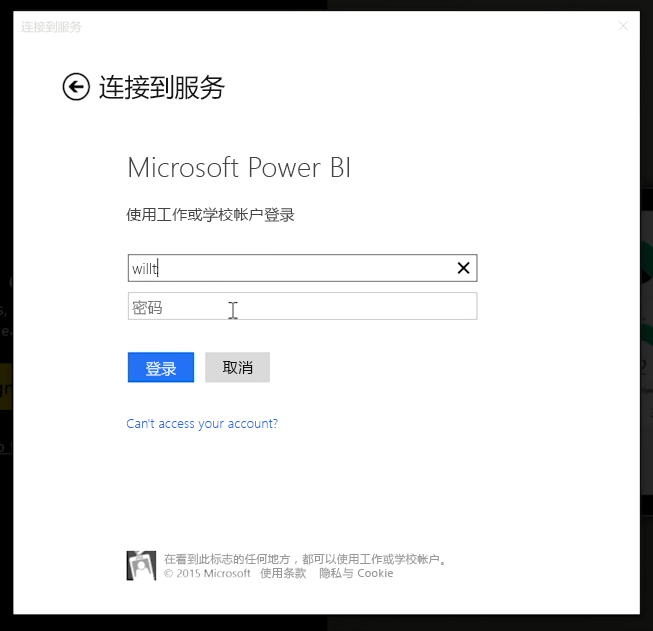
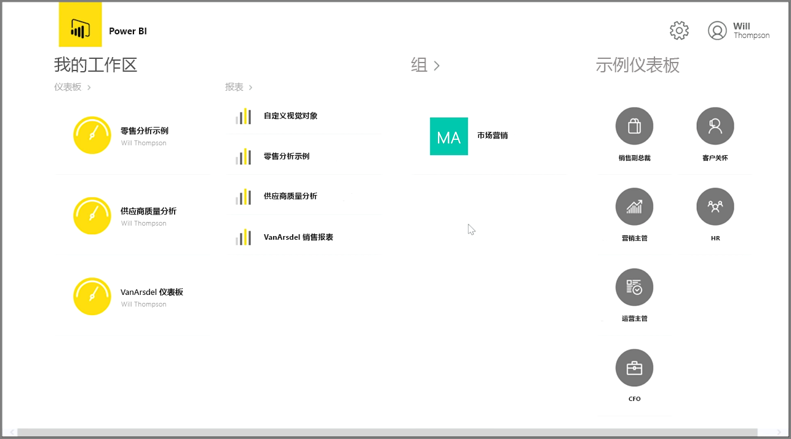
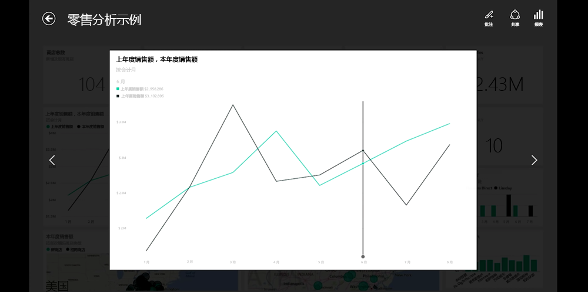
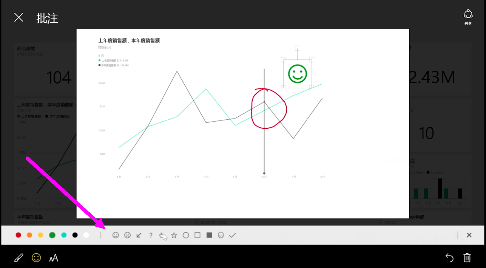

如果你想在移动中对数据进行跟踪，你可以使用适用于 iOS、Android 和 Windows 设备的其中一个 Power BI 移动应用程序。

当使用 Power BI 应用时，请首先使用 Power BI 服务帐户信息登录你的帐户。 在 Windows 移动设备上（在此示例中为平板电脑），“登录”如下所示。

你将看到的第一个屏幕中显示了你可以访问的所有内容，包括报表、仪表板和组。 也有你可以用于获得灵感，或只是查看 Power BI 功能的示例仪表板。 该应用设计成便于触摸：点击仪表板或报表以全屏查看并使用手指滚动浏览。

你可以通过点击打开任何仪表板。 在仪表板内，你可以点击仪表板磁贴以在较大的视图中聚焦它。

你还可以通过点击右上角的**批注**按钮批注任何你发现的见解。 这使你能够在聚焦的磁贴上进行绘制，以突出显示感兴趣的特定区域。 批注工具位于屏幕底部。

通过点击右上角的**共享**链接共享已批注的磁贴。

点击右上角的**报表**以查看磁贴的基础报表。 这将显示与你在 Web 浏览器或 Power BI Desktop 中所看到的完全一样的可视化效果，还包括了通过点击条形图、向下钻取或使用切片器与报表进行交互的功能。

