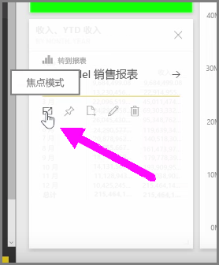
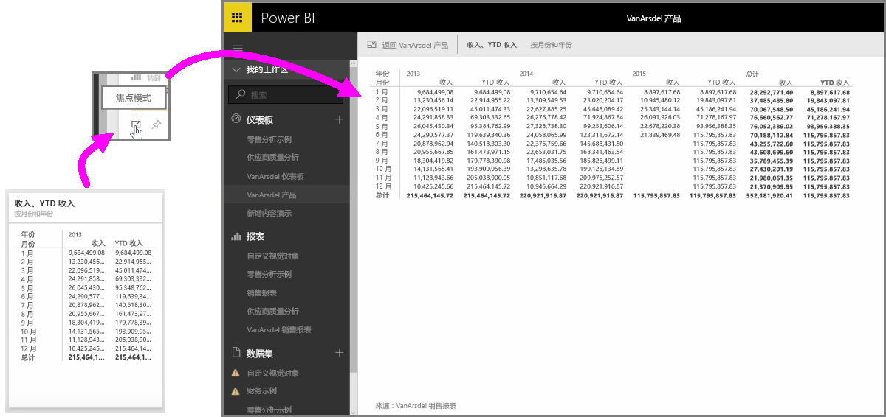

在该服务中查看 Power BI 仪表板或报表时，它有时有助于你集中查看个别图表或可视化效果。 有两种不同的方式可以实现该功能。

当你查看仪表板时，将鼠标悬停在磁贴上，此时右上角会出现几个不同的图标选项。 当选择省略号（即三个句点）时，你会看到一些图标，这些图标表示可在磁贴上执行的操作。

最左侧的图标标签是**焦点模式**。 选择该图标展开磁贴以覆盖整个仪表板空间。

**焦点模式**能让你看到视觉对象和图例上的更多详细信息。 例如，当调整 Power BI 中磁贴的大小时，受磁贴中可用空间的影响某些列可能不会显示。

在**焦点模式**下，你能看到所有的数据。 通过选择**固定**图标，你还可以直接在焦点模式下将视觉对象固定到其他仪表板。 若要退出**焦点模式**，在**焦点模式**的左上角选择**返回...**。

在查看报表时，操作过程与上述过程类似。 将鼠标悬停在视觉对象上，此时右上角会出现三个图标，然后选择**焦点模式**图标。 选择此图标展开视觉对象以覆盖整个报表画布。 此模式下视觉对象虽然会暂时失去交叉筛选作用，但其仍是可交互的。

将鼠标悬停在展开的磁贴或报表上，选择左上角的插入点图标**返回...**，以回到上一个视图。

