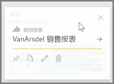
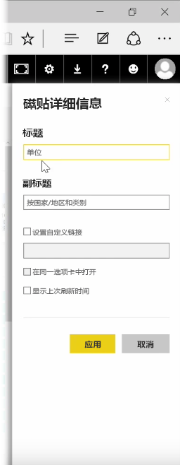
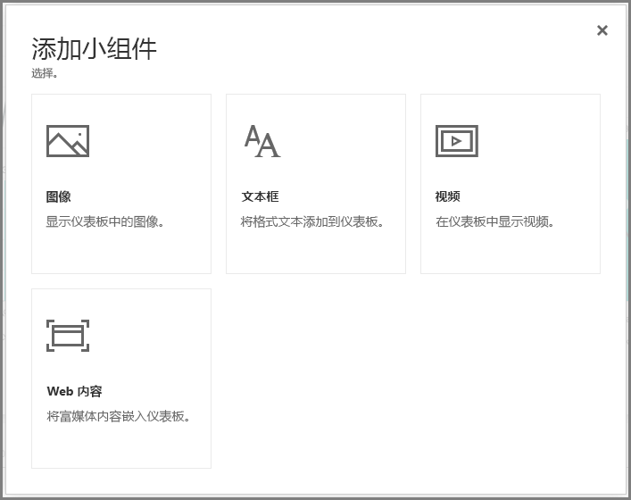
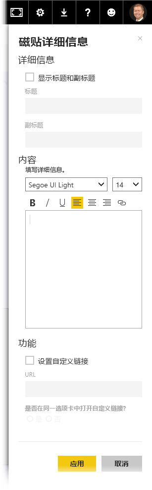

构建仪表板后，即可在 Power BI 服务中编辑其 * *磁贴* 以进行一些格式更改。

若要对磁贴进行更改，请将鼠标悬停在该磁贴上并选择省略号（三个点）以显示一系列图标，可通过这些图标对磁贴进行更改。

选择**钢笔**图标以打开**磁贴详细信息**窗格。 可以从此处更改磁贴的**标题**、**副标题**，包括其上次刷新时间和日期以及其他详细信息，如创建自定义链接。

默认情况下，单击仪表板磁贴时将转到它源自的报表。 若要更改此行为，请使用**磁贴详细信息**窗格中的**设置自定义链接**字段。 此功能的常见用途之一是在单击徽标图像时将用户转到组织主页。

## 将小组件添加到仪表板
还可以将小组件添加到仪表板。 **小组件**是特殊的仪表板磁贴，它并不包含可视化效果，而是包含其他项目，如图像、联机视频、文本框或丰富的 Web 内容。

当你选择仪表板右上角的“添加小组件”链接时，将显示**添加小组件**对话框。

例如，添加文本框时，将在右侧显示**磁贴详细信息**窗格，可在此处编辑详细信息，这些详细信息与编辑任何磁贴的详细信息时可编辑的内容相同。 但对于小组件来说，还有一个用于定义或修改小组件内容的部分，如文本框的富文本编辑器。

凭借小组件和编辑磁贴详细信息的功能，你可以对仪表板进行自定义，使其外观符合你的要求。

