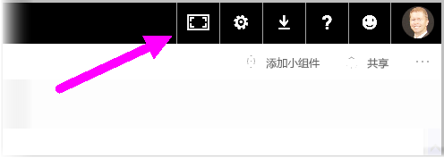
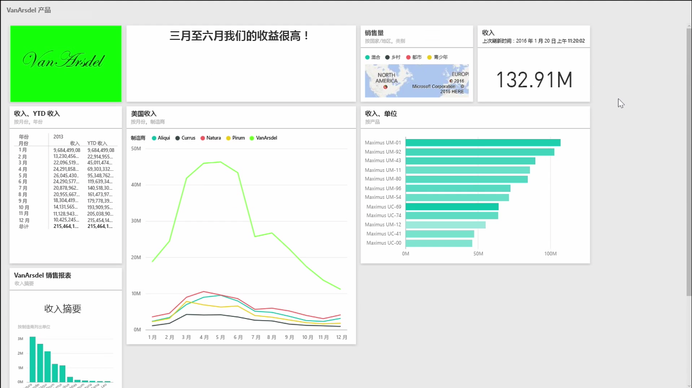
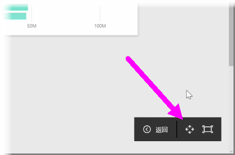
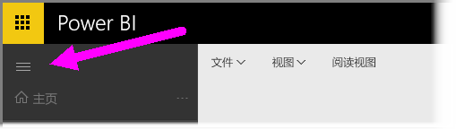

你可能偶尔会发现，创建仪表板时，你的内容较多，无法在画布上完全呈现。 有几个解决方案，可以帮助你管理仪表板空间的显示方式，以便可以获得全视图的仪表板内容。

在一个屏幕上显示整个仪表板的最简单方式是，选择仪表板右上角的**全屏模式**按钮。

选择**全屏模式**按钮可使浏览器处于全屏幕模式，删除仪表板边框的所有镶边元素，从而扩大可视区范围。

在**全屏模式**内，你可以选择**适应屏幕**选项压缩所有磁贴，以使其适合单个屏幕，而不需要滚动条。 这通常称为 *电视模式* ，并可用于借助仪表板进行演示，或在走廊监视器上显示仪表板。

管理仪表板空间的另一种方法是，通过选择汉堡图标，折叠页面左侧的导航窗格。 若要展开导航窗格，请再次单击该图标。

你可以通过将下面的内容追加到 URL 末尾来确保仪表板始终具有折叠的导航栏：

> ?collapseNavigation=true
> 
> 

遵循该链接的用户将打开具有折叠导航栏的仪表板。

