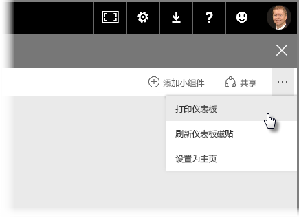
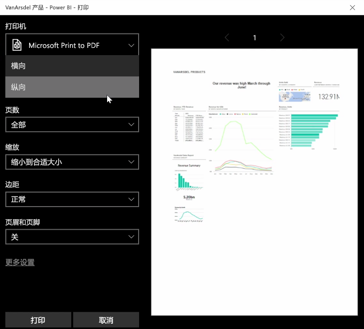
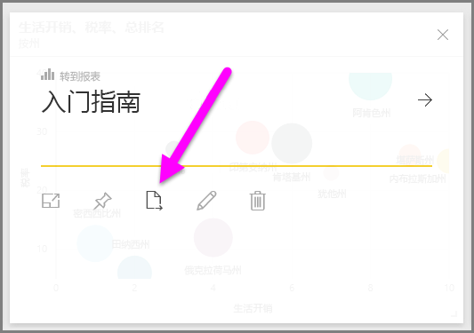
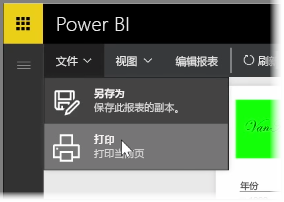

有时可能需要在会议中使用打印的报表或仪表板，以便与他人共享这些内容。 借助 Power BI，即可通过几种方式打印输出视觉对象。

在 Power BI 服务中，选择服务右上方的省略号（三个点），然后选择**打印仪表板**。

将显示**打印**对话框，你可以从中选择将仪表板发送到哪一台打印机，以及标准打印选项，如纵向或横向打印方向。

## 从视觉对象导出数据
你还可以从 Power BI 服务中的任何其他视觉对象导出数据。 只需选择任一视觉对象上的省略号，然后选择**导出数据**按钮（中间的按钮）即可。 当你执行此操作时，将创建一个 .CSV 文件并将其下载到本地计算机，并且浏览器上将显示一条消息告（就像任何其他由浏览器启动的下载）知你下载已完成。

你还可以从报表中直接打印或导出。 在 Power BI 服务中查看报表时，请选择**文件 > 打印**以打开打印对话框。

就像仪表板一样，你也可以通过选择视觉对象上的导出按钮，从报表中视觉对象导出数据。

