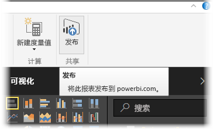

你可以更新已从 Power BI Desktop 发布到 Power BI 服务的报表和数据集。 若要执行此操作，请从功能区的**主页**选项卡上选择**发布**。

发布已存在于 Power BI 服务中的报表时，系统将提示你确认是否要将以前的数据集和报表替换为编辑后的版本。

选择**替换**后，Power BI Desktop 最新版本文件中的数据集和报表将覆盖 Power BI 服务中的数据集和报表。

与 Power BI Desktop 中的其他**发布**事件一样，你将看到一个对话框，显示发布事件已成功，并获得 Power BI 服务中报表的链接。

这是手动刷新数据的一种方法。 也可以自动更新数据集和报表；该过程在另一个学习主题中有介绍。

