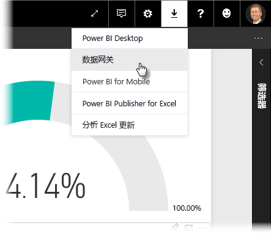
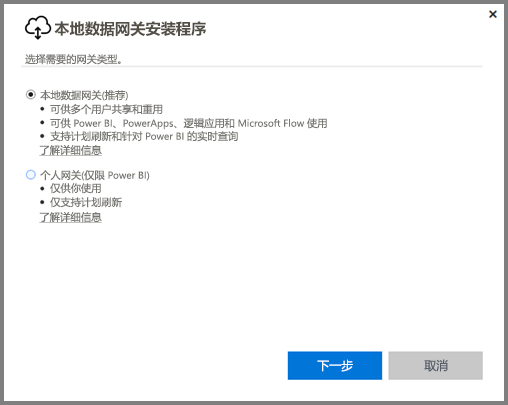
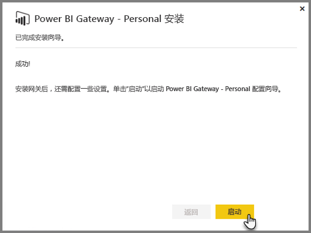
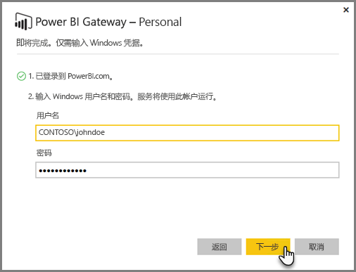
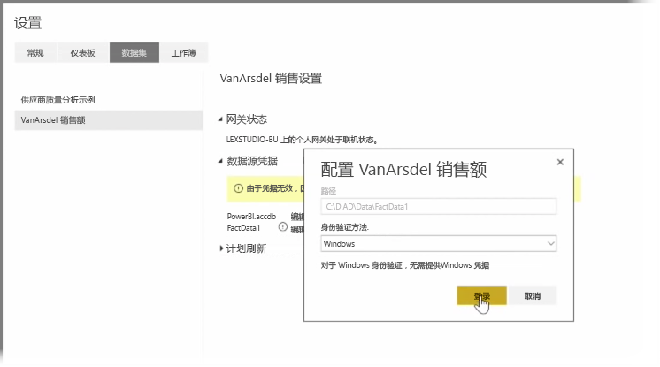
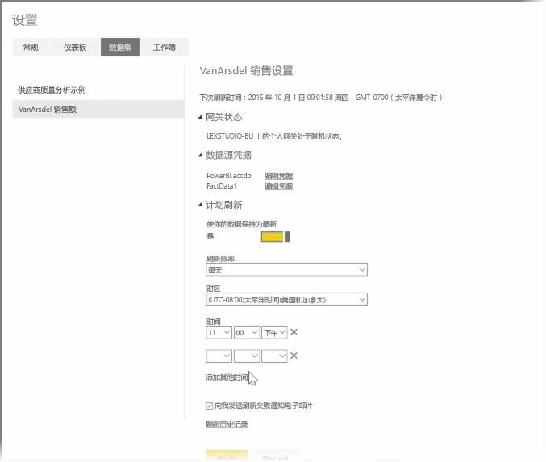

在前面的主题中，我们介绍了如何使用 Power BI 连接到数据源以及如何手动刷新 Power BI 服务中的数据集。 但是，你不希望每次数据更改时都手动刷新，因此可以使用 Power BI 设置计划刷新，计划刷新将连接到你的数据源并将其自动发布到 Power BI 服务。 还可通过此方法将服务连接到任何本地数据源（包括 Excel 文件、Access 数据库、SQL 数据库等）。

用于将本地数据源连接到 Power BI 服务的系统称为**数据网关**。 它是在计算机上运行的小型应用程序，按预先安排的计划来连接数据、收集任何更新并将其推送到 Power BI 服务。 **个人网关**是**数据网关**的一个版本，可在没有任何管理员配置的情况下使用。

>[!NOTE]
>运行 Power BI Personal Gateway 的计算机必须位于且连接到 Internet，个人网关才会正常运行。
> 

要设置**个人网关**，请首先登录到 Power BI 服务。 选择屏幕右上角的**下载**图标，然后从菜单中选择“**数据网关**”。

你将从此处转到一个网页，可以在其中选择 **Power BI Gateway - Personal**，如下所示。

完成下载后，运行应用程序，并完成安装向导。

系统提示你启动配置向导来设置网关。

网关服务在你的帐户中运行，因此，系统将首先要求你登录 Power BI 服务帐户，然后登录计算机的 Windows 帐户。

返回到 Power BI 服务。 选择你要刷新的数据集旁边的省略号（三个点），然后选择**计划刷新**。 这将打开**刷新设置**页。 Power BI 检测到你已安装**个人网关**，并告知你它的状态。

选择每个适用数据源旁边的**编辑凭据**并设置身份验证。

最后，设置**计划刷新**下的选项以激活自动更新并设置其发生时间和频率。

就是这么简单。 在计划的时间，Power BI 将使用你提供的凭据和对运行着你的**个人网关**的计算机的连接进入这些数据源，并按照你的计划更新报表和数据集。 在你下次转到 Power BI 时，这些仪表板、报表和数据集将反映截至最近计划刷新的数据。

## 后续步骤
**祝贺你！** 你已经完成了 Power BI **引导学习**课程的**研究数据**部分。 Power BI 服务提供众多浏览数据、分享见解和与视觉对象交互的有趣方法。 而且可从浏览器（一个随时随地都可以连接到的服务）使用所有这些方法。

Power BI 的一个功能强大且众所周知的伙伴是 **Excel**。 Power BI 和 Excel 设计旨在能够很好地协同工作；你的工作薄能够完全适应 Power BI，而且很容易便能将它们导入。

有多容易呢？ 在下一部分的 **Power BI 和 Excel** 中，你将具体了解。

下一部分见！

