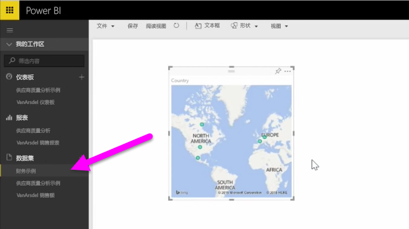

在本主题中，我们将首先了解一下如何将包含简单**表**的 Excel 工作簿文件从本地驱动器导入 Power BI。 然后了解如何通过在 Power BI 中创建报表开始浏览该表的数据。

## 确保数据已格式化为表格
为了使 Power BI 从工作簿导入数据，需要将这些数据**格式化为表格**。 这很容易。 在 Excel 中，你可以突出显示某个范围的单元格区域，然后在 Excel 功能区的**插入**选项卡上，单击**表格**。

你需要确保每列均具有有效的名称。 它将能够使你在 Power BI 中创建报表时更轻松地找到你想要的数据。

## 从本地驱动器导入
无论将文件保存在何处，通过 Power BI 都可以轻松导入它们。 在 Power BI 中，你可以使用**获取数据**  >  **文件**  >  **本地文件**以查找并选择我们想要的 Excel 文件。

一旦数据导入到 Power BI，你便可以开始创建报表。

当然，你的文件无需位于本地驱动器。 如果你将文件保存在 OneDrive 或 SharePoint 团队网站上，那就更好了。 我们将在稍后的某个主题中介绍其详细信息。

## 开始创建报表
导入工作簿的数据之后，就会在 Power BI 中创建一个数据集。 它将出现在**数据集**中。 现在可以通过创建报表和仪表板开始浏览数据了。 只需单击数据集旁边的**打开菜单**图标，然后单击**浏览**。 此时会出现一个新的空白报表画布。 在右上角的**字段**下，你将看到表格和列。 只需选择你想要在画布上创建新的可视化效果的字段。

你可以更改可视化效果的类型并应用**可视化效果**下的**筛选器**和其他属性。

