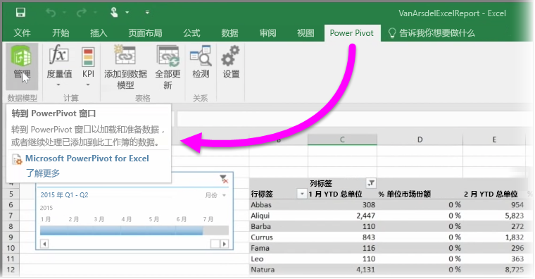

如果你使用 Excel 的任何高级 BI 功能，如使用 **Power Query**（在 Excel 2016 中称为**获取和变换**）查询和加载数据，使用 **Power Pivot** 创建功能强大的数据模型以及使用 **Power View** 创建动态报表，你也可以将这些功能导入 Power BI。

如果你使用 **Power Pivot** 创建高级数据模型，如具有多个相关表格、度量值、计算列和层次结构的数据模型，Power BI 也将导入所有相关内容。

如果你的工作簿具有 **Power View 工作表**，也没问题。 Power BI 会将它们重建为 Power BI 中的新**报表**。 你可以立即开始将可视化效果固定到仪表板。

下面是 Power BI 的强大功能之一：如果你使用 Power Query 或 Power Pivot 连接、查询和加载外部数据源中的数据，将工作簿导入 Power BI 后，你便可以设置**计划刷新**。 通过使用计划刷新，Power BI 将用你的工作簿中的连接信息直接连接到数据源并查询和加载已更改的任何数据。 报表中的任何可视化效果也将自动更新。

