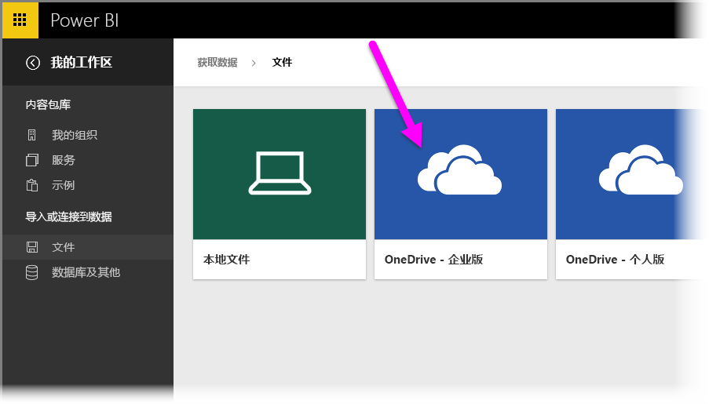
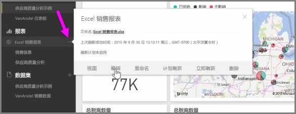

将 Excel 工作簿保存到 OneDrive 时，在 Power BI 和 Excel 之间实现无缝集成。

因为 OneDrive 和 Power BI 一样，也在云端，所以需要在 Power BI 与 OneDrive 之间进行实时连接。 如果对 OneDrive 上的工作簿进行了更改，则那些更改将 *自动同步* 到 Power BI。 报表和仪表板中的可视化效果将保持为最新状态。 如果工作簿连接到外部数据源（如数据库或 OData 数据源），则可以使用 Power BI 的**计划刷新**功能检查是否有更新。 需要对工作簿中的数据进行提问？ 没问题。 可以使用 Power BI 的**问答**功能做到这一点。

可以通过两种方式连接到 OneDrive for Business 上的 Excel 文件：

1. 将 Excel 数据导入到 Power BI
2. 在 Power BI 中连接、管理和查看 Excel

### 将 Excel 数据导入到 Power BI
如果选择将 Excel 数据导入到 Power BI，会将工作簿中的表数据加载到 Power BI 的新数据集中。 如果工作簿中有任何 **Power View** 工作表，则该工作表也会被导入，并在 Power BI 中自动创建新的报表。

Power BI 将保持自身与 OneDrive for Business 上的工作簿文件之间的连接。 如果对工作簿进行了任何更改，保存更改后，这些更改通常都将在一小时内 *自动同步* * 到 Power BI。 如果工作簿连接到外部数据源，则可以设置计划刷新，以便 Power BI 中的数据集保持为最新。 因为 Power BI 中的报表和仪表板中的可视化效果将使用数据集中的数据，所以浏览时你的查询将快如闪电。

### 在 Power BI 中连接、管理和查看 Excel
如果选择连接到 Excel 工作簿，则可以实现处理 Excel 工作簿和 Power BI 之间的无缝体验。 通过这种方式连接时，工作簿的报表旁边有一个小的 Excel 图标。

在 Power BI 中查看 Excel 工作簿的方式与在 **Excel Online** 中查看工作簿的方式相同。 你可以通过从省略号菜单中选择编辑来在 Excel Online 中浏览和编辑你的工作表。 进行更改时，将自动更新任何固定到仪表板的可视化效果。

未在 Power BI 中创建任何数据集。 所有数据均保留在 OneDrive 的工作簿中。 这种方法的优点之一是如果工作簿连接到外部数据源，则可以设置**计划刷新** 你可以选择诸如数据透视表和图表等元素，并将其直接**固定**到 Power BI 的仪表板中。 进行的任何更改都将自动反映在 Power BI 中。 并且你还可以使用 Power BI 出色的**问答**功能来对工作簿中的数据进行提问。  

