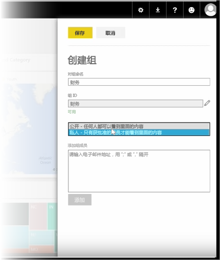
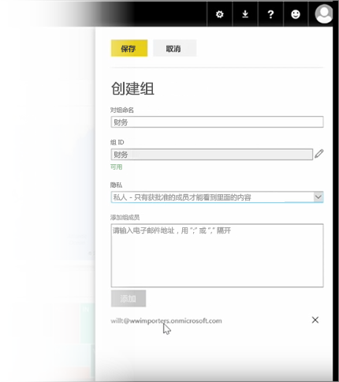

在本课程中，我们首先创建组。 **组**定义了一组有权访问特定仪表板、报表和数据的用户。

Power BI 中的组基于 Office 365 中的组，因此如果你已使用了 Office 365 组来管理组的电子邮件、日历和文档，那么你会发现 Power BI 提供了相同的功能等。 当你在 Power BI 中创建组时，实际上是在创建 Office 365 组。

此模块使用设置新的财务组的方案。 我们将演示如何设置组、将仪表板、报表和数据集共享进组，并添加将具有访问组中项目的权限的成员。

我在“我的工作区”中开始。 这些是我已创建或他人与我共享的仪表板、报表和数据集。

如果我展开“我的工作区”，我可以选择**创建组**。

此处我可以为其指定名称。 我们正在使用该方案或财务组，因此我将称它“财务”。 Power BI 可确保域上不存在该名称。

我通过确定是否允许组织中的任何人或仅其成员可以查看组的内容，来设置隐私级别。

我在此处键入电子邮件地址、安全组和通讯组列表。 我选择**添加**以使他们成为组员，并保存该组。

继续下一课程！

