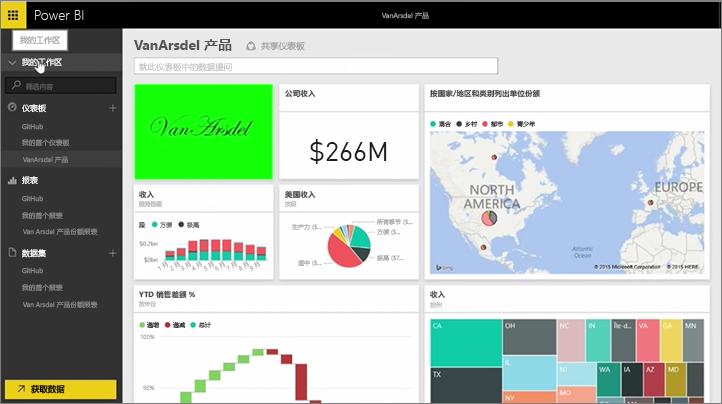
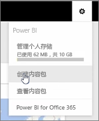
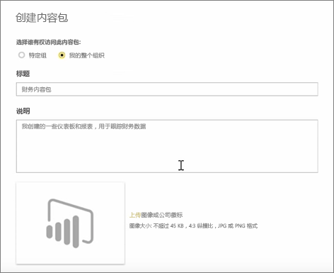

在本课程中，我们将使用 Power BI 中现有的项目创建内容包，然后与同事共享。

在**我的工作区**中有一个仪表板、仪表板下面的报表和数据集。 我希望将它们作为一个包与我的组织中的人员共享，以便他们可以重用这些项目。

当我选择**设置**图标（位于服务右上角的齿轮）时，我可以看到我已使用多少存储空间，以及是否可以创建内容包。

在显示的对话框中，我可以选择是否将其分发到特定人员或组，以及是否还设置一个标题。 在**描述**框中提供详细说明也是一个不错的想法，以便浏览内容包的人员知道该内容包包含什么或提供什么项目。

在对话框的底部，我有机会上载内容包的图像，然后是最重要的步骤：我将选择我想要在此内容包中包括的仪表板，当我这样做时，Power BI 会自动选择仪表板中所使用的报表和数据集。 我无法取消选择报表或数据集，因为我要在内容包中包含的仪表板需要它们。

我还可以选择其他仪表板、报表和数据集，但现在不选。

当我发布后，此内容包将被添加到组织的内容库中。

继续下一课程！

