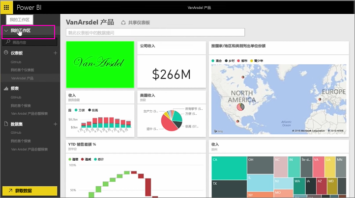
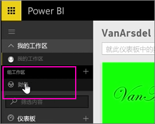
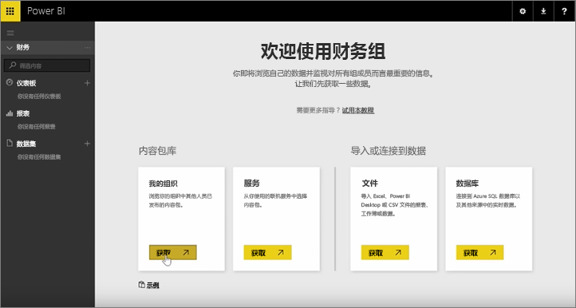
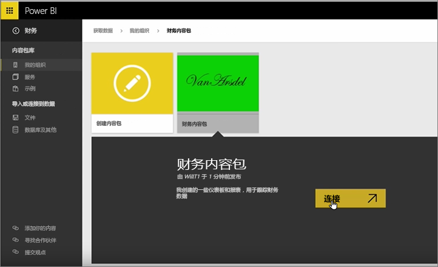
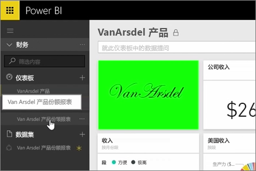
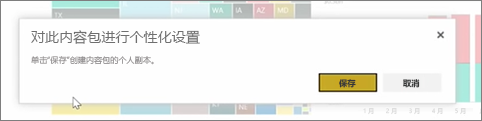
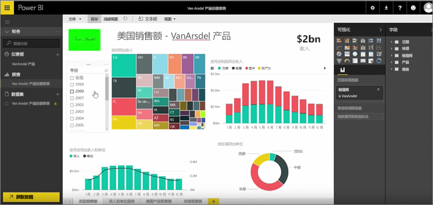

在前面的课程中，我们已创建内容包和组。 在本课程中，我们将为组中的每个人创建内容包实例。

我在“我的工作区”中开始，...

...然后切换回我在前面的课程中创建的财务组。

该组没有任何仪表板、报表或数据集。 我将使用自己创建的内容包。 我浏览我的组织中的内容包，而不是来自第三方服务的内容包。

我找到一分钟前自己创建的内容包。 我明白了为什么为内容包设置适当的标题、说明和图像很重要，因为这样可以方便用户找到它。 我连接该内容包。

power BI 将导入内容包中的仪表板、报表和数据集。

选择数据集时，Power BI 询问我是否想要对内容包进行个性化设置。

我将创建自己可以进行更改的内容包的副本，并将其与已发布版本的内容包断开连接。 如果内容包创建者对已发布的版本进行了更改，我不会自动获得这些更新。

但如果我想，我可以编辑仪表板、报表，甚至数据集。

因此内容包是一种重用组织中的其他人员创建的内容的简单方法。

继续下一课程！

