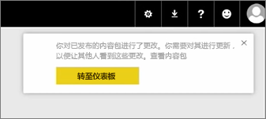
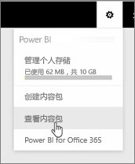

在本课程中，我们要编辑之前创建的原始内容包，并学习如何让已连接到此内容包的其他人知道这些更新。

我已返回到“我的工作区”，编辑我的原始仪表板。

每当我对仪表板进行任何更改，系统都会提醒我更改了内容包中和别人共享的一些东西，并提示我更新共享的版本。

我返回到设置图标并选择**查看内容包**以查看我已发布的内容包。

我看到自己所做的内容包。 此小图标告诉我我已更改内容包中的一些东西，我需要编辑该内容包，以便其他人可以看到我的更改。

当我选择**编辑**时，我返回到可以编辑标题和说明的屏幕，但这次该屏幕中有一个**更新**按钮，因此我选择了该按钮。

Power BI 接受了这些更改，并将更新的内容包发布到内容包库。

任何连接到我的内容包的人会收到一条消息，告知内容包已更改，并询问他们是接受所做的更改还是保留较旧版本。

因此，作为内容包的所有者，你可以管理你的同事所使用的版本。

