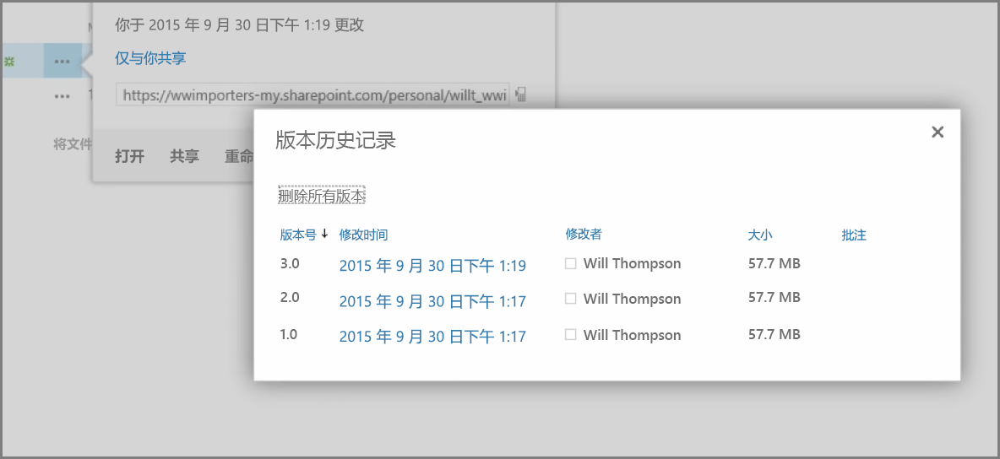
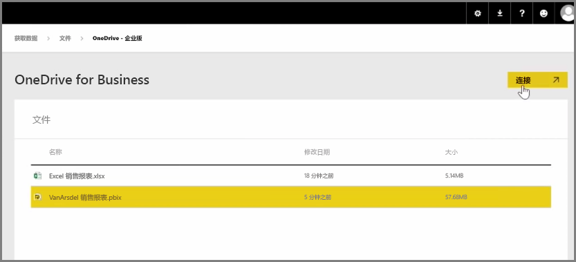
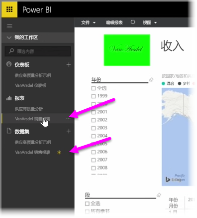

在前面的文章中我们回顾了创建组来帮助组织管理 Power BI 中的内容并在此基础上进行协作。 你还可以借助 **OneDrive for Business** 使用 Power BI / Office365 组进行协作和共享。

将 OneDrive for Business 用作 Power BI 内容的一个源，可以让你访问大量有用的工具，如版本历史记录。 你还可以在 OneDrive for Business 中与Office365 组共享你的文件，以便向许多人授予访问权限，允许他们处理相同的 Power BI 或 Excel 文件。

若要在 OneDrive for Business 上连接 PBIX (Power BI Desktop) 文件，请登录 Power BI 服务，然后选择**获取数据**。 选择“导入”下面的**文件**，或选择“连接到数据”，然后选择 **OneDrive - 业务**。 突出显示所需的文件，然后选择**连接**。

你的内容将显示在导航栏左侧。

现在，对 **OneDrive for Business** 上的文件所做的任何更改都将自动在 Power BI 环境中反映，并且在版本历史记录中记录。

