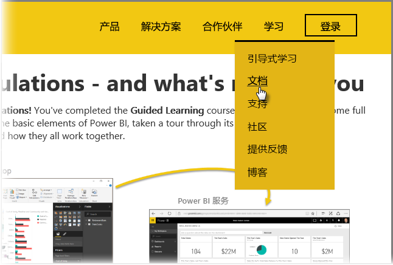

你做到了！ **祝贺你！** 你已经完成了 Power BI 的“引导学习”课程。 你已经学习了 Power BI 的所有基本元素、浏览了它的软件功能和元素，并学习了它们如何一起工作。

这是本课程的最后一节（也是最后一个主题 - 除非你想学习 DAX），所以如果你按顺序学习了所有这些章节，现在是时候给自己点个赞了。 做得好！ 现在你已经熟悉了所有这些**重要概念**：

* 什么是 [Power BI](0-0-what-is-power-bi.md)
* Power BI 的[构建块](0-0b-building-blocks-power-bi.md)
* [获取](1-2-connect-to-data-sources-in-power-bi-desktop.md)和[建模](2-1-intro-modeling-data.md)数据
* [可视化效果](3-1-intro-visualizations.md)
* 在 Power BI 服务中[浏览数据](4-0-intro-power-bi-service.md)
* 结合使用 [Excel 和 Power BI](5-1-intro-excel-data.md)
* [发布和共享](6-0-intro-content-packs-groups.md)你的工作

知识很多，既然所有这些知识都已经在你的脑子里，那么准备将它们付诸于实践吧！ 下面是一些“下载链接”或将你的浏览器“连接到 Power BI 服务”的链接：

* 可以始终[获取最新的 Power BI Desktop](https://powerbi.microsoft.com/desktop)
* 前往 [Power BI 服务](https://powerbi.microsoft.com/)很容易
* 点击一下即可获取[适用于 Power BI 的移动应用](https://powerbi.microsoft.com/mobile/)

还提供了更多“帮助和参考”内容。 只需转到此页的顶部，并选择“学习>文档”以查看我们广泛的 Power BI 参考内容。

我们希望你能享受“Power BI 引导学习”的体验之旅。 祝你好运，愿你的 Power BI 视觉对象永远散发迷人光彩。

## 针对 DAX 用户的另外一节
还想了解更多吗？ 你是否有兴趣了解如何在 Power BI 中使用 **DAX（数据分析表达式）**进行创建、筛选，或者使用自定义列和表？ 还有一节专门针对想在 Power BI 中从事代码操作的用户，此节就是 **DAX 简介**。 看看你是否感兴趣 - 此节中所用的方法与“引导学习”中的其他部分的方法一样简单。

