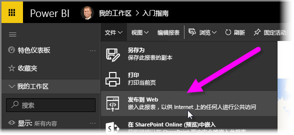
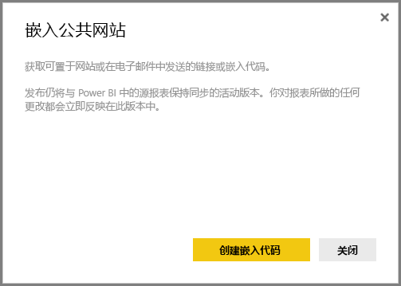
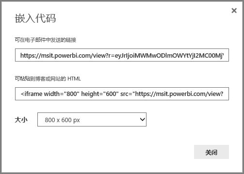
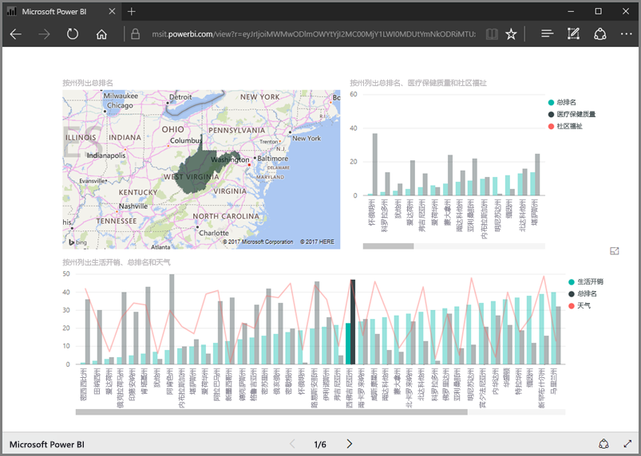
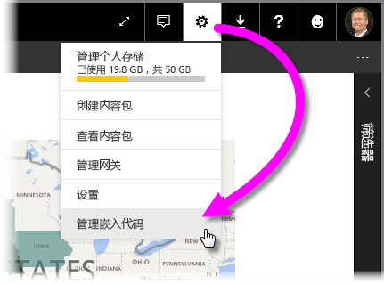
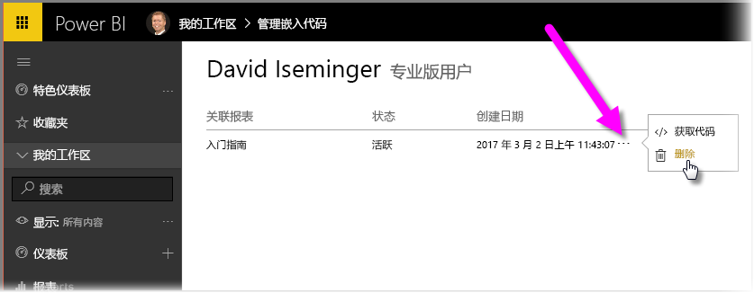

在本课程中，我们将了解如何通过简单几步在网页上或通过电子邮件共享 Power BI 报表。 这项 Power BI 功能通常被称为“**发布到 Web**”，非常易于使用和管理。

在 Power BI 中，选择要共享的报表，使其显示在画布上。 然后，在菜单中，依次选择“**文件 > 发布到 Web**”。

此时，你会看到一个对话框，提示你将生成在网站上或在邮件中添加报表所需的 *嵌入代码* 。

选择“ **创建嵌入代码** ”后，Power BI 便会显示另一对话框，再次提示你即将与 Internet 上的所有人共享你的数据。 请务必确认共享！

Power BI 显示一个包含以下两个链接的对话框：

* 可以在电子邮件中共享的链接（将报表显示为网页）
* 可用于将报表直接嵌入网页的 HTML 代码（iframe 内的链接）

对于 HTML 链接，可以选择嵌入报表的预定义尺寸，也可以自行修改 iframe 代码并自定义报表尺寸。

只需将电子邮件链接粘贴到浏览器中，即可查看 Web 形式的报表。 可以与此网页进行交互，就像在 Power BI 中查看报表一样。 下图展示了“**发布到 Web**”页，我们将其链接直接从对话框复制到浏览器中：

还可以将 iframe 链接嵌入博文、网站或 Sway 中。

要删除所创建的嵌入代码？ 没问题。 在 Power BI 中，依次选择右上角的**齿轮**图标和“**管理嵌入代码**”。

此时，Power BI 工作区会显示你已创建的嵌入代码（在下图中，只有一个嵌入代码）。 单击省略号后，可以选择获取嵌入代码，也可以选择完全删除嵌入代码。

将 Power BI 报表发布到 Web 并与全球用户进行共享的演示到此结束了。 操作起来非常简单！

