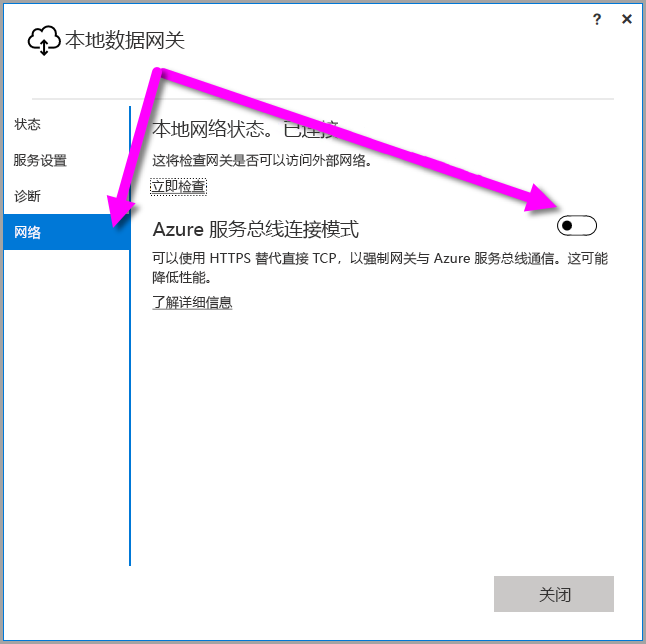
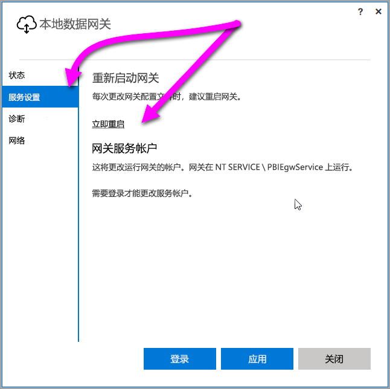

## <a name="sign-in-account"></a>登录帐户
用户将使用工作或学校帐户登录。 这是你的组织帐户。 如果你注册了 Office 365 产品/服务，但没有提供实际的工作电子邮件，则可能类似于 nancy@contoso.onmicrosoft.com。你在云服务中的帐户存储于 Azure Active Directory (AAD) 中的租户内。 在大多数情况下，你的 AAD 帐户的 UPN 将与电子邮件地址匹配。

## <a name="windows-service-account"></a>Windows 服务帐户
本地数据网关配置为使用 NT SERVICE\PBIEgwService 作为 Windows 服务登录凭据。 默认情况下，它有权作为服务登录。 这位于正在安装网关的计算机的上下文中。

> [!NOTE]
> 如果选择了个人模式，则需单独配置 Windows 服务帐户。
> 
> 

这不是用于连接到本地数据源的帐户。  也不是登录到云服务的工作或学校帐户。

如果你由于身份验证遇到有关代理服务器的问题，你可能需要将 Windows 服务帐户更改为域用户或托管服务帐户。 可以在[代理配置](../service-gateway-proxy.md#changing-the-gateway-service-account-to-a-domain-user) 中了解如何更改帐户。

## <a name="ports"></a>端口
网关将创建与 Azure 服务总线的出站连接。 它可在以下出站端口上进行通信：TCP 443（默认）、5671、5672、9350 至 9354。  网关不需要入站端口。 [了解详细信息](https://azure.microsoft.com/documentation/articles/service-bus-fundamentals-hybrid-solutions/)

建议你将防火墙中数据区域的 IP 地址列入白名单。 可以下载 [Microsoft Azure 数据中心 IP 列表](https://www.microsoft.com/download/details.aspx?id=41653)。 此列表每周更新。 网关使用 IP 地址以及完全限定的域名 (FQDN) 与 Azure 服务总线进行通信。 如果使用 HTTPS 强制网关进行通信，则网关将仅使用 FQDN，如果使用 IP 地址则不会进行通信。

> [!NOTE]
> Azure 数据中心 IP 列表中的 IP 地址以 CIDR 表示法列出。 例如，10.0.0.0/24 并不意味着 10.0.0.0 至 10.0.0.24。 了解有关 [CIDR 表示法](http://whatismyipaddress.com/cidr)的详细信息。
> 
> 

下面是网关使用的完全限定的域名的列表。

| 域名 | 出站端口 | 说明 |
| --- | --- | --- |
| *.download.microsoft.com |80 |用于下载安装程序的 HTTP。 |
| *.powerbi.com |443 |HTTPS |
| *.analysis.windows.net |443 |HTTPS |
| *.login.windows.net |443 |HTTPS |
| *.servicebus.windows.net |5671-5672 |高级消息队列协议 (AMQP) |
| *.servicebus.windows.net |443, 9350-9354 |基于 TCP 的服务总线中继侦听程序（要求使用端口 443 来获取访问控制令牌） |
| *.frontend.clouddatahub.net |443 |HTTPS |
| *.core.windows.net |443 |HTTPS |
| login.microsoftonline.com |443 |HTTPS |
| *.msftncsi.com |443 |当 Power BI 服务无法访问网关时，用于测试 Internet 连接。 |
| *.microsoftonline-p.com |443 |用于根据配置进行身份验证。 |

> [!NOTE]
> 访问 visualstudio.com 或 visualstudioonline.com 的流量用于应用见解，而非网关作业所需。
> 
> 

## <a name="forcing-https-communication-with-azure-service-bus"></a>强制 HTTPS 与 Azure 服务总线通信
可以使用 HTTPS 替代直接 TCP，以强制网关与 Azure 服务总线通信。 这可能会对性能产生影响。 若要执行此操作，请通过将值从 `AutoDetect` 更改为 `Https` 来修改 *Microsoft.PowerBI.DataMovement.Pipeline.GatewayCore.dll.config* 文件，如紧接本段后面的代码片段中所示。 默认情况下，此文件位于 *C:\Program Files\On-premises data gateway* 。

```
<setting name="ServiceBusSystemConnectivityModeString" serializeAs="String">
    <value>Https</value>
</setting>
```

ServiceBusSystemConnectivityModeString 参数的值区分大小写。 有效值为 AutoDetect 和 Https。

或者，从 [2017 年 3 月](https://powerbi.microsoft.com/blog/power-bi-gateways-march-update/)版本开始，用户可以使用网关用户界面来强制网关采用此行为。 在网关用户界面中，选择“网络”，然后将“Azure 服务总线连接模式”切换至“启用”。



更改后，在选择“应用”（该按钮仅在做出更改时出现）后，*网关 Windows 服务* 将自动重启，从而使更改生效。

可以通过选择“服务设置”，然后选择“立即重启”从用户界面对话框中重启*网关 Windows 服务* 以供将来参考之用。



## <a name="support-for-tls-1112"></a>对 TLS 1.1/1.2 的支持
自 2017 年 8 月更新起，本地数据网关默认使用传输层安全 (TLS) 1.1 或 1.2 与 Power BI 服务进行通信。 以前版本的本地数据网关默认使用 TLS 1.0。 2018 年 3 月 15 日，将不再支持 TLS 1.0，包括使用 TLS 1.0 与 Power BI 服务进行交互的网关功能。因此，届时必须将本地数据网关安装升级到 2017 年 8 月版或更高版本，才能确保网关可以继续正常运行。

值得注意的是，TLS 1.0 在 11 月 1 日之前仍受本地数据网关支持，并由网关用作回退机制。 要确保所有网关流量使用 TLS 1.1 或 1.2（并防止在网关上使用 TLS 1.0），必须在运行网关服务的计算机上添加或修改以下注册表项：

        [HKEY_LOCAL_MACHINE\SOFTWARE\Microsoft\.NETFramework\v4.0.30319]"SchUseStrongCrypto"=dword:00000001
        [HKEY_LOCAL_MACHINE\SOFTWARE\Wow6432Node\Microsoft\.NETFramework\v4.0.30319]"SchUseStrongCrypto"=dword:00000001

> [!NOTE]
> 添加或修改这些注册表项会将更改应用于所有 .NET 应用程序。 有关影响其他应用程序的 TLS 的注册表更改的信息，请参阅[传输层安全性 (TLS) 注册表设置](https://docs.microsoft.com/windows-server/security/tls/tls-registry-settings)。
> 
> 

## <a name="how-to-restart-the-gateway"></a>如何重启网关
网关作为一项 Windows 服务运行。 像任何 Windows 服务一样，你可以启动和停止它。 有多种方法可以执行此操作。 下面是你可以如何从命令提示符执行此操作。

1. 在运行网关的计算机上，启动管理员命令提示符。
2. 使用以下命令停止服务。
   
   net stop PBIEgwService
3. 使用以下命令启动服务。
   
   net start PBIEgwService

