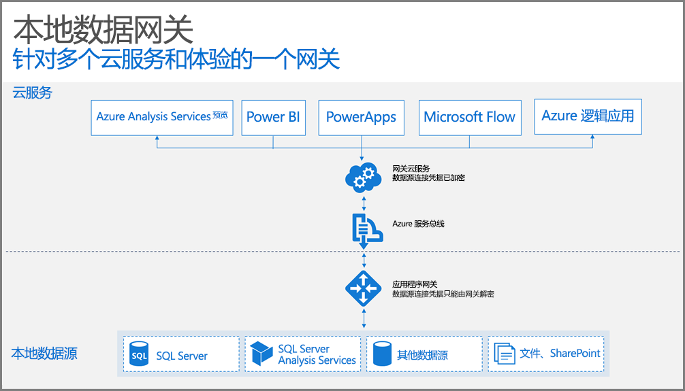

## 网关的工作原理

让我们首先看一下当用户与连接到本地数据源的元素交互时，会发生什么情况。 

> [!NOTE]
> 对于 Power BI，需要配置网关的数据源。
> 
> 

1. 云服务将创建查询以及本地数据源的加密凭据，并将其发送到队列中以让网关进行处理。
2. 网关云服务将分析该查询，并将请求推送到 [Azure 服务总线](https://azure.microsoft.com/documentation/services/service-bus/)。
3. 本地数据网关将为挂起的请求轮询 [Azure 服务总线](https://azure.microsoft.com/documentation/services/service-bus/)。
4. 网关获取查询、解密凭据并使用这些凭据连接到数据源。
5. 网关将查询发送到数据源执行。
6. 执行的结果从数据源发出，返回到网关，然后到云服务上。 然后，服务将使用该结果。

