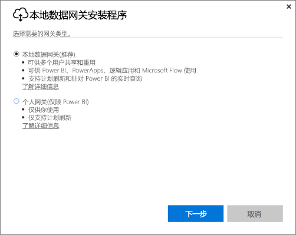
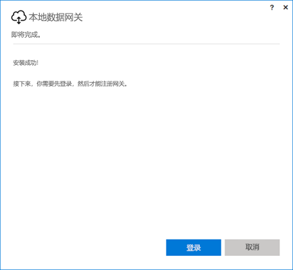
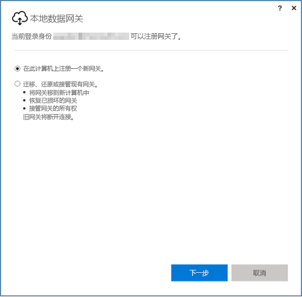
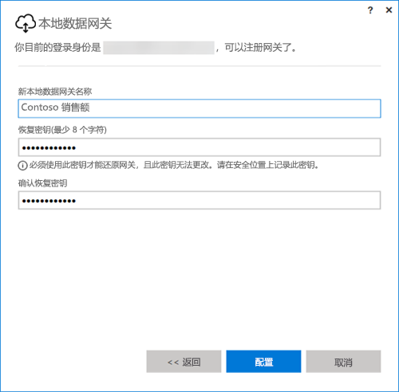

## 安装本地数据网关
在计算机上安装和运行数据网关。 最好可以在持续运行的计算机上安装网关。

> [!NOTE]
> 只有 64 位 Windows 操作系统才支持该网关。
> 
> 

对于 Power BI，首先你需要选择网关的模式。

* **本地数据网关：** 在此模式中，多个用户可以共享和重复使用网关。 Power BI、PowerApps、Flow 或逻辑应用可以使用此网关。 对于 Power BI，这包括支持计划刷新和 DirectQuery
* **个人：** 此模式仅适用于 Power BI，可以作为无需任何管理员配置的个人身份使用。 仅可用于按需刷新和计划刷新。 选择此模式后，便会开始安装个人网关。

无论安装上述哪一种模式的网关，都需要注意以下几点：

* 两个网关都需要 64 位 Windows 操作系统
* 网关不能安装在域控制器上
* 同一台计算机上最多可以安装两个本地数据网关，分别在两个模式（个人和标准）下运行。 
* 在同一台计算机上，不能有多个网关在相同模式下运行。
* 可以在不同计算机上安装多个本地数据网关，并通过同一 Power BI 网关管理界面管理所有这些网关（个人网关除外，见下一注意点）
* 只能为每个 Power BI 用户运行一个个人模式网关。 如果为同一用户安装另一个人模式网关，即使是在其他计算机上，最新安装也会替换现有旧安装。

以下是安装网关之前需要考虑的一些事项。

* 如果要在笔记本电脑上安装，但是笔记本电脑已关闭，没有连接到 Internet，或处于休眠状态，网关将不起作用，云服务中的数据将不会与本地数据同步。
* 如果计算机已连接到无线网络，网关运行可能较慢，这会导致云服务中的数据与本地数据同步需要更长的时间。

安装网关后，需要使用工作或学校帐户登录。

登录后，必须选择配置新的网关，或迁移、还原或接管现有网关。

## 配置新网关
1. 输入网关“名称”
2. 输入“恢复密钥”。 此恢复密钥至少应为 8 个字符。
3. 选择“**配置**”。

> [!NOTE]
> 如果你需要迁移、还原或接管网关，则需要恢复密钥。 请确保将此密钥保存在安全的位置。
> 
> 

### 迁移、还原或接管现有网关
你需要选择想要恢复的网关，并提供用于首次创建网关的恢复密钥。

### 连接本地数据网关
配置网关后，可使用它来连接到本地数据源。

如果是 Power BI 网关，则需要将你的数据源添加到 Power BI 服务中的网关内。 在“**管理网关**”区域中完成此操作。 可以参阅与管理数据源相关的文章，了解详细信息。

对于 PowerApps，则需要为受支持数据源的定义连接选择网关。 对于 Flow 和逻辑应用，可在进行本地连接时使用此网关。

