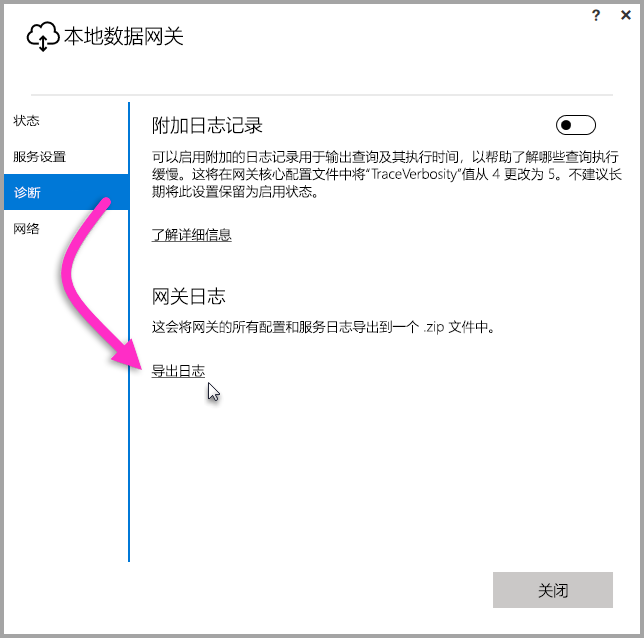
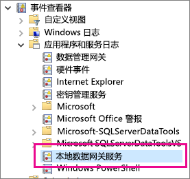

## 用于故障排除的工具
<a name="logs" />

### 从网关配置器收集日志
可以收集多个网关日志，应始终从日志入手。 在安装网关后收集日志的最简单方法是通过用户界面。 在“本地数据网关”用户界面中，依次选择“诊断”和页面底部附近的“导出日志”链接，如下图所示。

**安装程序日志**

    %localappdata%\Temp\On-premises_data_gateway_*.log

**配置日志**

    %localappdata%\Microsoft\On-premises Data Gateway\GatewayConfigurator*.log

**本地数据网关服务日志**

    C:\Users\PBIEgwService\AppData\Local\Microsoft\On-premises Data Gateway\Gateway*.log

### 事件日志
**本地数据网关服务**事件日志位于“应用程序和服务日志”下。

<a name="fiddler" />

### Fiddler 跟踪
[Fiddler](http://www.telerik.com/fiddler) 是 Telerik 提供的一款用于监视 HTTP 流量的免费工具。  可以从客户端计算机通过 Power BI 服务来回查看。 这可能会显示错误和其他相关的信息。

