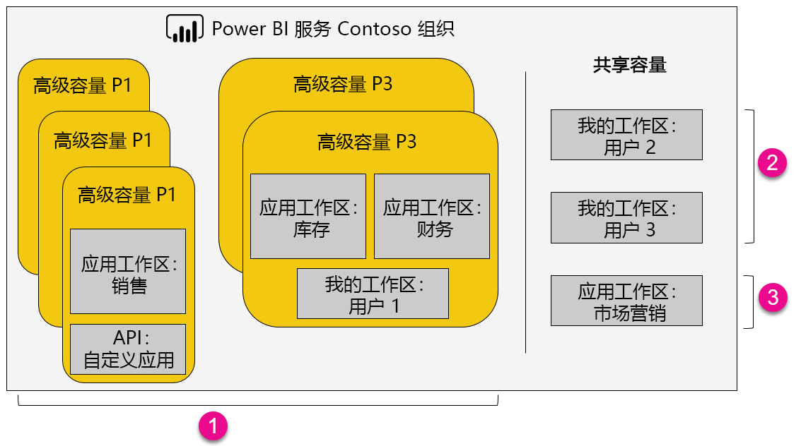

1. Premium 容量中的项
   
   * 访问应用工作区（以成员或管理员身份）和发布应用都需要使用 Power BI Pro 许可证。
   * 应用读者可以是 Power BI Pro 用户或免费用户。
   * 共享需要 Power BI Pro 许可证，但接收人可以是 Power BI Pro 用户或免费用户。
   * 不管使用的是 Power BI Pro 许可证还是免费许可证，仪表板接收者都可以设置数据警报。
   * 用于嵌入的 REST API 利用具有 Power BI Pro 许可证的服务帐户，而不是用户的服务帐户。
2. 共享容量中的我的工作区
   
   * 共享需要 Pro 许可证。 接收人也需要 Pro 许可证。
3. 共享容量中的应用工作区
   
   * 任何应用使用都需要 Pro 许可证。

