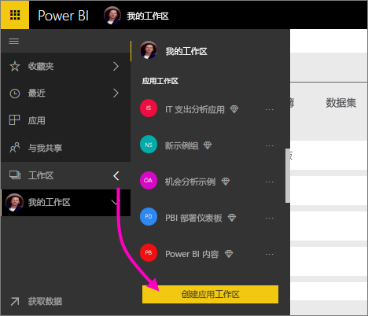
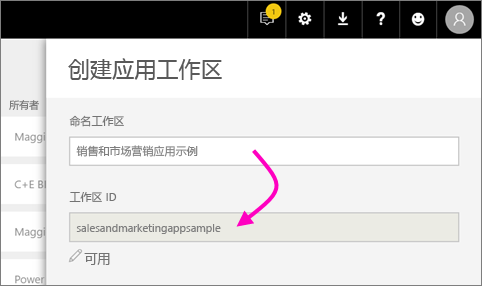
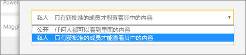
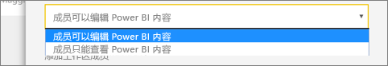
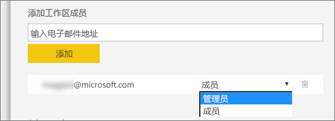

1. 首先，创建工作区。 选择“工作区” > “创建应用工作区”。
   
     
   
    这里将放置你和你的同事协作处理的内容。

2. 为工作区命名。 如果对应的“工作区 ID”不可用，则进行编辑以给定一个唯一的 ID。
   
     这也是应用的名称。
   
     

3. 需要设置几个选项。 如果你选择“公开”，则组织中的任何人都可以看到工作区内容。 而如果选择“专用”，则意味着只有工作区的成员可以查看其内容。
   
     
   
    创建组后，将不能更改公共/私有设置。

4. 还可以选择成员是可以“编辑”还是具有“仅查看”访问权限。
   
     
   
     仅向应用工作区添加用户，以便他们能够编辑内容。 如果他/她只是要查看内容，请勿将其添加到工作区。 可以在发布应用时对其进行添加。

5. 添加你要允许其访问工作区的用户的电子邮件地址，然后选择“添加”。 无法添加组别名，只能添加单个用户别名。

6. 确定每个人员的身份是成员还是管理员。
   
     
   
    管理员可以编辑工作区本身，包括添加其他成员。 成员可以编辑工作区中的内容，除非他们只具有“仅查看”访问权限。 管理员和成员均可以发布应用。

7. 选择**保存**。

Power BI 创建工作区并将其打开。 它显示在你作为成员的工作区的列表中。 作为管理员，你可以选择省略号(…) 返回并进行更改，添加新成员或更改其权限。

