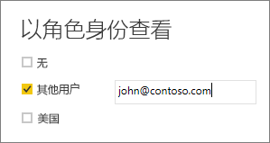

## 验证 Power BI Desktop 中的角色
创建角色后，你可以测试 Power BI Desktop 中的角色结果。 若要执行此操作，请选择“以角色身份查看”。

“以角色身份查看”对话框允许更改正在查看的特定用户或角色的视图。 你可以看到创建的角色。

选择创建的角色，然后选择“确定”，将角色应用于正在查看的视图。 报表仅呈现与该角色相关的数据。

你还可以选择其他用户，并提供给定用户。 最好提供用户主体名称 (UPN)，因为 Power BI 服务使用该名称。 选择“确定”，报表将基于该用户能看到的呈现内容。 

> [!NOTE]
> 在 Power BI Desktop 中，如果使用的是基于 DAX 表达式的动态安全，报表仅显示不同的结果。
> 
> 

