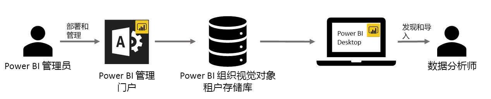

# 在 Power BI 中使用组织自定义视觉对象

可以在 Power BI 中使用自定义视觉对象创建为你量身定做的唯一视觉对象类型或你尝试传达的数据见解。 通常由开发人员创建这些自定义视觉对象，在 Power BI 中包含的大部分视觉对象不是十分满足他们的需求时，常常会创建此类视觉对象。 

在某些组织中，自定义视觉对象尤为重要，可能必须使用它们来传递特定数据或组织的唯一见解，它们可能具有特殊数据要求，或者可以高亮显示专用业务方法。 此类组织需要开发自定义视觉对象，在其整个组织中共享这些视觉对象，并确保对其进行正常维护。 Power BI 自定义视觉对象可让组织实现上述目标。

下图显示了 Power BI 中的组织自定义视觉对象从管理员处通过开发和维护最终转到数据分析人员处的过程。

由管理门户的 Power BI 管理员部署和管理组织视觉对象。 视觉对象一旦部署到组织的存储库，组织中的用户便可以轻松发现它们，并直接从 Power BI Desktop 将组织的自定义视觉对象导入其报表。

## 使用组织的自定义视觉对象

若要详细了解如何在创建的报表中使用组织的自定义视觉对象，请参阅以下文章：[详细了解如何将组织的视觉对象导入报表](power-bi-custom-visuals.md)。
 
## 管理组织的自定义视觉对象

若要详细了解如何管理、部署和管理组织中的组织自定义视觉对象，请参阅以下文章：[详细了解如何部署和管理组织自定义视觉对象](https://go.microsoft.com/fwlink/?linkid=866790)。

> [!WARNING]
> 自定义视觉对象可能包含存在安全或隐私风险的代码。 在将其部署到组织存储库之前，请务必信任任何自定义视觉对象的作者和来源。 
> 

## 注意事项和限制
 
需要注意几个注意事项和限制。
 
管理员：

* 不支持旧的自定义视觉对象（如不是基于新版本的 API 生成的自定义视觉对象）

* 如果从存储库中删除自定义视觉对象，那么使用已删除的视觉对象的任何现有报表将不再呈现。 存储库中的删除操作是不可逆的。 若要暂时禁用自定义视觉对象，请使用“禁用”功能。
 
最终用户：

* Power BI 工作区集合不支持使用组织视觉对象

* 如果来自 AppSource 市场的 Visio 视觉对象、PowerApps 视觉对象和 GlobeMap 视觉对象通过组织存储库部署，它们将不会呈现
