# 浏览报表“筛选器”窗格
本文将深入介绍报表“筛选器”窗格。 你将在 [Power BI 服务编辑视图和阅读视图](service-reading-view-and-editing-view.md)以及 [Power BI Desktop 报表视图](desktop-report-view.md)中看到该窗格。

在 Power BI 中可以使用多种不同的方式筛选数据，我们建议首先阅读 [关于筛选器和突出显示](power-bi-reports-filters-and-highlighting.md)。

## 使用刷选器
可在[编辑视图或阅读视图](service-reading-view-and-editing-view.md)中打开报表。 在“编辑视图”中，报表所有者可 [向报表添加筛选器](power-bi-report-add-filter.md)，这些筛选器将与报表一起保存。 在“阅读视图”中查看报表的人员可与这些筛选器进行交互，但不能将筛选器更改保存到该报表。

## “阅读视图”中的筛选器
在“阅读视图”中打开报表时，“筛选器”窗格显示在报表画布的右侧。 如果未看到窗格，请选择右上角的箭头以将其展开。

在此示例中，我们选择了具有 6 个筛选器的视觉对象。 报表页也有筛选器，列于“页面级筛选器”标题下。 有一个[钻取筛选器](power-bi-report-add-filter.md)，整个报表也有筛选器：“FiscalYear”为 2013 或 2014。

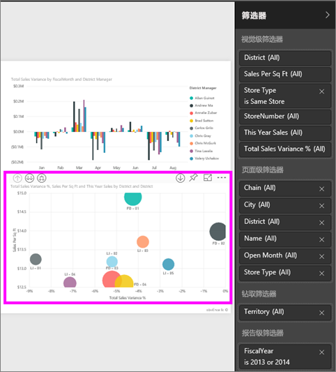

部分筛选器旁有“全部”字样，这意味着所有值都包含在一个筛选器中。  例如，下面的屏幕截图中的 **Chain(All)** 告诉我们该报表页包括有关所有存储链的数据。  从另一方面来说，“**FiscalYear 为 2013 或 2014**”的报表级别筛选器告诉我们该报表仅包括 2013 和 2014 的财政年的数据。

查看此报表的任何人都可与这些筛选器进行交互。

* 悬停鼠标并选择筛选器旁的箭头可查看该筛选器的详细信息。
  
   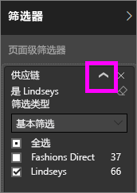
* 更改筛选器，例如，将 **Lindseys** 更改为 **Fashions Direct**。
  
     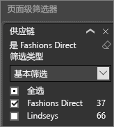
* 选择筛选器名称旁的 **x** 可删除筛选器。
  
  删除筛选器将其从列表删除，但并不会删除报表的数据。  例如，如果删除 **FiscalYear 为 2013 或 2014** 筛选器，财政年数据仍将保留在报表中，但将不再筛选为仅显示 2013 和 2014，而是显示数据包含的所有财政年。  但是，一旦删除筛选器后，将无法再对其修改，因为它已从列表删除。 更好的选择是通过选择橡皮擦图标来清除筛选器 。
  
  

## “编辑视图”中的筛选器
在“编辑视图”中打开报表时，“筛选器”窗格显示在“**可视化效果**”窗格底部中的报表画布右侧。 如果未看到窗格，请选择右上角的箭头以将其展开。

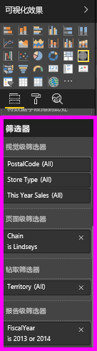.  

如果画布中未选择任何视觉对象，则“筛选器”窗格将仅显示适用于整个报表页面或整个报表的筛选器以及任何钻取筛选器（如果已设置有）。 在以下示例中，未选择视觉对象，并且没有页面级筛选器或钻取筛选器，但存在报表级筛选器。  

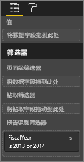  

如果画布中选择了一个视觉对象，则你还会看到仅适用于该视觉对象的筛选器：   

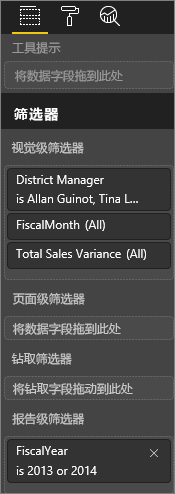

若要显示特定筛选器的选项，请选择该筛选器名称旁的向下箭头。  在以下示例中，报表级筛选器被设置为 2013 和 2014。 这是**基本筛选**的一个示例。  若要显示高级选项，请选择**高级筛选**。

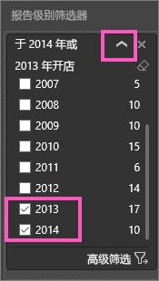

## 清除筛选器
 在高级或基本筛选器模式下，选择橡皮擦图标  以重置筛选器。 

## 添加筛选器
* 在编辑视图中，通过从“字段”窗格中选择一个字段并将其拖动到相应的筛选器（其中你会看到“将字段拖至此处”字样），从而将筛选器添加到视觉对象、页面、钻取或报表。 将字段作为筛选器添加后，使用基本筛选和高级筛选控件对其进行微调（如下所述）。

- 将新字段拖动到视觉对象级筛选器区域不会将该字段添加到视觉对象，但是它的确允许你使用此新字段来筛选该视觉对象。 在以下示例中，“**链**”作为新筛选器添加至视觉对象中。 请注意，在使用基本或高级筛选控制前，仅将“**链**”添加为筛选器不会更改视觉对象。

    

* 用于创建可视化效果的所有字段都还可用作筛选器。 首先，选择视觉对象以将其激活。 “视觉对象”窗格和“筛选器”窗格（在“视觉对象级别筛选器”标题下方）中列出了视觉对象中正在使用的字段（如果你处于编辑视图）。
  
   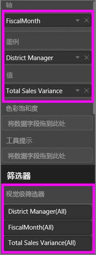  
  
   使用基本筛选和高级筛选控制（如下所述）对任意这些字段进行微调。

## 筛选器类型：文本字段筛选器
### 列表模式
勾选复选框将选择或取消选择值。 **全部**复选框可用于切换所有复选框的状态（“启用”或“取消”）。 这些复选框表示该字段的所有可用值。  调整筛选器时，重述将更新以反映你的选择。 

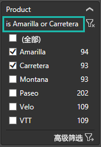

注意，现在重述的表述方式“为 Amarilla 或 Carretera”

### 高级模式
选择**高级筛选**以切换到高级模式。 使用下拉控件和文本框来标识要包括哪些字段。 通过在**且**和**或**之间选择，可以生成复杂的筛选器表达式。 设置所需值后，选择**应用筛选器**按钮。  

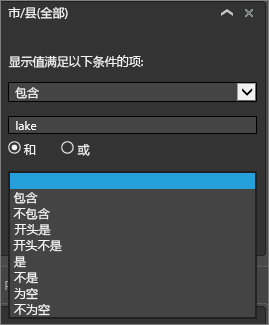

## 筛选器类型：数值字段筛选器
### 列表模式
如果这些值是有限的，则选择字段名称将显示一个列表。  请参阅前述**文本字段筛选**&gt;**列表模式**来帮助使用复选框。   

### 高级模式
如果这些值有限或表示一个范围，则选择字段名称将打开高级筛选器模式。 使用下拉列表和文本框来指定想要查看的值的范围。 

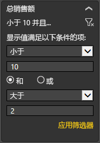

通过在**且**和**或**之间选择，可以生成复杂的筛选器表达式。 设置所需值后，选择**应用筛选器**按钮。

## 筛选器类型：日期和时间
### 列表模式
如果这些值是有限的，则选择字段名称将显示一个列表。  请参阅前述**文本字段筛选**&gt;**列表模式**来帮助使用复选框。   

### 高级模式
如果字段值表示日期或时间，可以使用“日期/时间”筛选器指定开始/结束时间。  

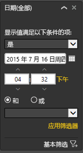

## 后续步骤
[报表中的筛选器和突出显示](power-bi-reports-filters-and-highlighting.md)  
[在报表的“阅读视图”中与筛选器和突出显示交互](service-reading-view-and-editing-view.md)  
[在报表“编辑视图”中创建筛选器](power-bi-report-add-filter.md)  
[更改报表视觉对象相互交叉筛选和交叉突出显示的方式](service-reports-visual-interactions.md)

了解有关 [Power BI 中的报表](service-reports.md)的详细信息  
[Power BI - 基本概念](service-basic-concepts.md)

更多问题？ [尝试参与 Power BI 社区](http://community.powerbi.com/)

