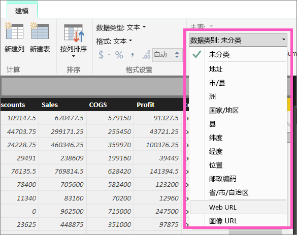
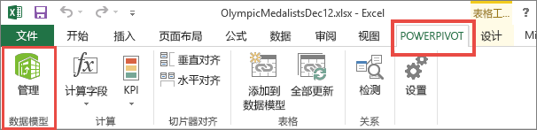
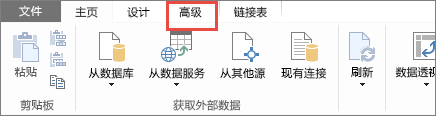
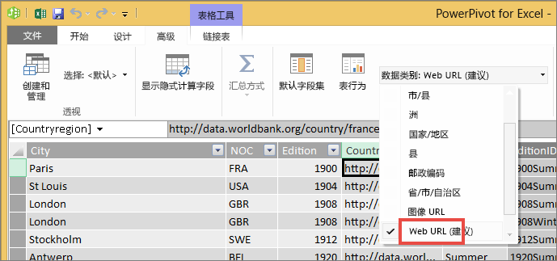

# 表中的超链接
本主题介绍如何使用 Power BI Desktop 创建超链接。 创建后，使用 Desktop 或 Power BI 服务将这些超链接添加到你的报表表格和矩形图。 

> **注意**：[仪表板上的磁贴](service-dashboard-edit-tile.md)和[仪表板上的文本框](service-dashboard-add-widget.md)中的超链接可使用 Power BI 服务实时创建。 [报表中的文本框](service-add-hyperlink-to-text-box.md)中的超链接可以使用 Power BI 服务和 Power BI Desktop 实时创建。
> 
> 

## 使用 Power BI Desktop 创建表或矩阵中的超链接
可在 Power BI Desktop 中创建表和矩形图中的超链接，但不能从 Power BI 服务进行此操作。 在将工作簿导入到 Power BI 之前，还可以在 Excel Power Pivot 中创建超链接。 这两种方法都在下面进行了介绍。

## 在 Power BI Desktop 中创建表或矩形图超链接
添加超链接的过程取决于是否已导入数据或使用 DirectQuery 连接至此。 这两种方案都在下面进行了介绍。

### 有关导入到 Power BI 的数据
1. 如果超链接尚未作为数据集中的字段存在，则使用 Desktop 将其添加为 [自定义列](desktop-common-query-tasks.md)。
2. 在“数据”视图中，选择该列，并在“建模”选项卡上选择“数据类别”下拉列表。
   
    
3. 选择 **Web URL**。
4. 切换到报表视图，并使用归类为 Web URL 的字段创建表或矩阵。 超链接为蓝色并带有下划线。
   
    
5. 如果不想在表中显示长 URL，可以改为显示超链接图标 。 请注意，不能在矩阵中显示图标。
   
   * 选择图表，使其处于活动状态。
   * 选择滚动油漆刷图标 ，打开“格式”选项卡。
   * 展开“**值**”，找到 **URL 图标** 并将其**打开。**
6. （可选）[将报表从 Desktop 发布到 Power BI 服务](guided-learning/publishingandsharing.yml?tutorial-step=2)，并在 Power BI 服务中打开报表。 超链接也将在那里运作。

### 对于与 DirectQuery 连接的数据
将无法在 DirectQuery 模式下创建一个新列。  但是，如果数据已包含 URL，可以将这些数据转变为超链接。

1. 在报表视图中，使用含有 URL 的字段创建表。
2. 选择该列，并在“**建模**”选项卡上选择“**数据类别**”下拉列表。
3. 选择 **Web URL**。 超链接为蓝色并带有下划线。
4. （可选）[将报表从 Desktop 发布到 Power BI 服务](guided-learning/publishingandsharing.yml?tutorial-step=2)，并在 Power BI 服务中打开报表。 超链接也将在那里运作。

## 在 Excel Power Pivot 中创建表或矩形图超链接
向 Power BI 表和矩形图添加超链接的另一个方法是从 Power BI 导入/连接到数据集前，在该数据集中创建超链接。 本示例使用 Excel 工作簿。

1. 在 Excel 中打开工作簿。
2. 选择 **PowerPivot** 选项卡，然后选择**管理**。
   
   
3. Power Pivot 打开时，选择“**高级**”选项卡。
   
   
4. 将光标置于包含你想要将其转换为 Power BI 表中的超链接的 URL 的列。
   
   > **请注意**：URL 必须以 **http:// 、 https://** 或 **www** 开头。
   > 
   > 
5. 在 **Reporting 属性**组中，选择**数据类别**下拉列表，然后选择 **Web URL**。 
   
   
6. 从 Power BI 服务或 Power BI Desktop 连接到或导入此工作簿。
7. 创建一个包含 URL 字段的表可视化效果。
   
   

## 注意事项和疑难解答
问：是否可以使用自定义 URL 作为表或矩阵中的超链接？    
答：不可以。 可以使用链接图标。 如需为你的超链接使用自定义文本且你的 URL 列表较短，请考虑改用文本框。

## 后续步骤
[Power BI 报表中的可视化效果](power-bi-report-visualizations.md)

[Power BI - 基本概念](service-basic-concepts.md)

更多问题？ [尝试参与 Power BI 社区](http://community.powerbi.com/)

