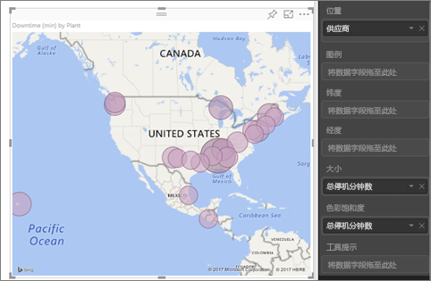
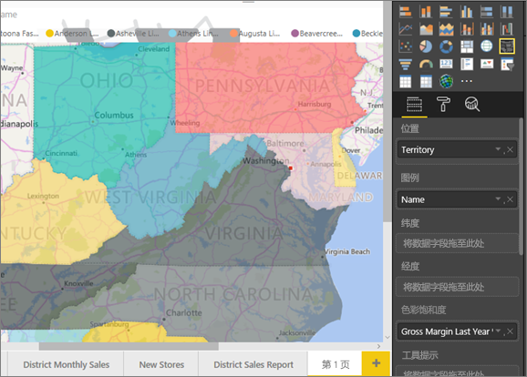
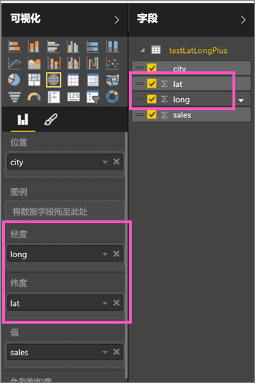
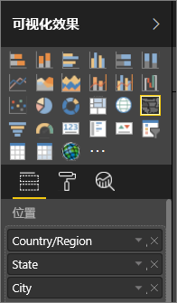

# 用于 Power BI 地图可视化效果的提示和技巧
Power BI 与必应地图集成，提供默认地图坐标（一种称为“地理位置编码”的过程），以便用户可以创建地图。 集成后，它们使用算法共同确定正确的位置，但有时只是一种最佳猜测。 如果 Power BI 无法尝试自行创建地图可视化效果，则会借助必应地图的帮助。 

你或管理员可能需要更新防火墙，以允许访问必应用来地理编码的 URL。  这些 URL 是：
* https://dev.virtualearth.net/REST/V1/Locations
* https://platform.bing.com/geo/spatial/v1/public/Geodata
* https://www.bing.com/api/maps/mapcontrol

若要增加地理编码正确的可能性，可使用以下提示。 第一组提示适合在有权访问数据集本身时参考。 第二组提示说明了当无权访问数据集时，可以在 Power BI 中执行的操作。 最后一组就是 URL 列表。

## 哪些数据会发送给必应地图？
Power BI 服务和 Power BI Desktop 向必应发送创建地图可视化效果所需的地理位置数据。 这可能包括“位置”、“纬度”和“经度”存储桶中的数据，以及任何“报表级别”、“页级别”或“视觉对象级别”筛选器存储桶中的地理字段。 发送的确切内容因地图类型而异。 若要了解详细信息，请参阅[必应地图隐私](https://go.microsoft.com/fwlink/?LinkID=248686)。

* 对于地图（气泡图），如果提供了纬度和经度，则不会向必应发送任何数据。 否则，将会向必应发送“位置”（和筛选器）Bucket 中的所有数据。     
* 着色地图需要获取“位置”Bucket 中的字段；即使已提供纬度和经度，也不例外。 “位置”、“纬度”或“经度”Bucket 中的所有数据都会发送给必应。
  
    在下面的示例中，字段“供应商”用于地理编码，因此所有供应商数据都会发送到必应。 “大小”和“颜色饱和度”存储桶中的数据不会发送到必应。
  
    
  
    在下面的第二个示例中，由于字段“区域”用于地理位置编码，因此所有区域数据都会发送给必应。 “图例”和“色彩饱和度”Bucket 中的数据不会发送给必应。
  
    

## 在数据集中：改进基础数据集的提示
如果你有权访问正用于创建地图可视化效果的数据集，可以执行以下几项操作，从而增加地理编码不出错的可能性。

**1.在 Power BI Desktop 中对地理字段进行分类**

在 Power BI Desktop 中，可以通过设置数据字段上的“数据类别”来确保字段进行了正确地理编码。 选择相应的表，转到“高级”功能区，再将“数据类别”设置为“地址”、“城市”、“洲”、“国家/区域”、“县”、“邮政编码”、“州”或“省/自治区/直辖市”。 这些数据分类有助于必应对日期进行正确编码。 若要了解详细信息，请参阅 [Power BI Desktop 中的数据分类](desktop-data-categorization.md)。 若要实时连接到 SQL Server Analysis Services，需要使用 [SQL Server Data Tools (SSDT)](https://docs.microsoft.com/sql/ssdt/download-sql-server-data-tools-ssdt)，在 Power BI 外部设置数据分类。

**2.使用多个位置列。**    
 有时，即使对地图设置数据分类也不足以使必应正确地猜测你的目标。 某些地理标记不明确，因为多个国家/区域都有相应的地理位置。 例如，英格兰、宾夕法尼亚州和纽约州都有南安普敦。

Power BI 使用必应的[非结构化 URL 模板服务](https://msdn.microsoft.com/library/ff701714.aspx)，来基于一组任何国家/地区的地址值获取纬度和经度坐标。 如果数据未包含足够的位置数据，请适当地添加这些列并对它们进行分类。

 例如，如果只有一个“城市”列，必应可能会在进行地理位置编码时遇到困难。 请添加其他地理位置列，以便可以明确确定位置。  有时，只需向数据集再添加一个位置列（在此示例中，即为“州/省/自治区/直辖市”）即可。 另外，也不要忘了进行正确分类，请参阅上面的第 1 条提示。

确保每个字段仅具有与分类关联的具体信息。  例如，你的“城市”位置字段应为“南安普敦”，而非“南安普敦、纽约”。  而“地址”位置字段应为“1 Microsoft Way”而非“1 Microsoft Way, Redmond, WA”。

**3.使用特定的纬度和经度**

向数据集添加纬度和经度值。 这将删除任何不确定的数据并更快地返回结果。 纬度和经度字段必须为十进制数格式，你可以在数据模型中进行设置。

<iframe width="560" height="315" src="https://www.youtube.com/embed/ajTPGNpthcg" frameborder="0" allowfullscreen></iframe>

**4.将“地点”类别用于具有完整位置信息的列**

虽然我们鼓励在地图中使用地理层次结构，但如果必须使用包含完整地理信息的单个位置列，可以将数据分类设置为“地点”。 例如，如果列中的数据是完整地址（例如，1 Microsoft Way, Redmond Washington 98052），则这个全面的数据类别最适合用于必应。 

## 在 Power BI 中：使用地图可视化效果时提高结果准确性的提示
**1.使用纬度和经度字段（若有）**

在 Power BI 中，如果所使用的数据集包含经度和纬度字段，请使用此类字段！  Power BI 提供有助于明确地图数据的特殊 Bucket。 只需将包含纬度数据的字段拖到“可视化效果>纬度”区域中即可。  对经度数据执行相同操作。 执行此操作时，你还需要在创建可视化效果时填充位置字段。 否则，数据将默认进行聚合，例如，将在州级别而不是市级别配对经纬度。

 

## 使用地理位置层次结构，以便可以向下钻取到不同的位置“级别”
如果数据集已有不同级别的位置数据，你和同事可以使用 Power BI 创建地理位置层次结构。 为此，请将多个字段拖到“位置”Bucket 中。 通过这种方式结合使用，字段将构成地理位置层次结构。 在下面的示例中，我们已添加了“国家/地区”、“州/省/自治区/直辖市”和“城市”地理位置字段。 在 Power BI 中，你和同事可以使用此地理位置层次结构，向上和向下钻取到不同的位置级别。

  

   

使用地理层次结构进行钻取时，请务必了解每个钻取按钮的工作原理和发送到必应地图的内容。 

* 钻取按钮位于最右侧，称为“深化模式”，可以使用它选择地图位置并向下钻取到该特定位置，每次钻取一级。 例如，如果启用“向下钻取”并单击“北美”，会向下移动到层次结构的下一级，即北美的各个州。 对于地理编码，Power BI 仅发送必应地图中北美的国家/地区和州数据。  
* 左侧还有另外 2 个钻取选项。 第一个选项  可用于立即钻取到所有位置中层次结构的下一级。 例如，如果你当前正在查看国家/地区，然后使用此选项移动到下一级：州，则 Power BI 会显示所有国家/地区的州数据。 对于地理编码，Power BI 会发送必应地图中所有地区的州数据（无国家/地区数据）。 如果层次结构的每一级与更高的级别不相关，则此选项非常有用。 
* 第二个选项，  类似于向下钻取，但无需在地图上进行单击。  它会向下扩展到记住当前级别的上下文的下一级层次结构。 例如，如果你当前正在看国家/地区并选择此图标，则会在层次结构中向下移动到下一级：州。 对于地理编码，Power BI 会发送每个州的数据及其对应的国家/地区，帮助必应地图更准确地进行地理编码。 在大部分地图中会使用此选项或最右侧的“向下钻取”选项，以便能够向必应发送尽可能多的信息以获取准确的位置信息。 

## 后续步骤
[在 Power BI 可视化效果中向下钻取](power-bi-visualization-drill-down.md)

[Power BI 可视化效果](power-bi-report-visualizations.md)

更多问题？ [尝试参与 Power BI 社区](http://community.powerbi.com/)

