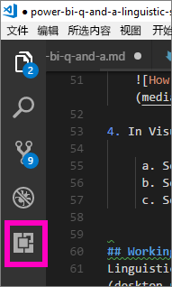
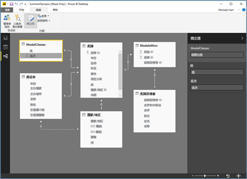

# <a name="language-modeling-and-the-linguistic-schema"></a>语言建模和语言架构 
使用常用短语和自然语言来查询数据是一个非常有用的功能。 在用数据回答问题时，该项功能更为强大，而这就是 Power BI“问答”功能的作用。 向 Power BI“问答”功能提问时，它会尽力给出正确答案。 

但为了让“问答”功能更好地交互，可采用一些方式改进答案——一种方式就是编辑语言架构。 

一切都从企业数据开始。  数据模型越好，用户就越容易得到高质量的答案。 改进模型的一种方法是添加语言架构，该架构对数据集中表名和列名的术语及两者之间的关系进行定义和分类。 可在 Power BI Desktop 中管理语言架构。 

## <a name="what-is-a-linguistic-schema"></a>语言架构的本质
语言架构描述了对数据集中的对象而言，“问答”功能应当理解的术语和短语，包括与该数据集相关的词性、同义词和短语。 导入或连接到数据集时，Power BI 将根据数据集的结构创建语言架构。 向“问答”功能提问时，它会在数据中查找匹配项和关系，以了解问题的意图。 例如，它查找名词、动词、形容词、短语和其他元素。 还将查找关系，例如哪些列是动词的对象。 

你可能熟悉词性（若不熟悉，请见下文），但可能对短语陌生。  短语就是你谈论事物相互关系的方式。 例如，要描述顾客与产品之间的关系，可以说“顾客购买产品”。 要描述顾客和年龄之间的关系，可以说“年龄表明顾客的年龄”。 要描述顾客和电话号码之间的关系，可以简单地说“顾客的电话号码”。

这些短语形状和大小不一。 有些与数据模型中的关系直接对应。 有些将列与其包含的表关联起来。 另一些则将复杂关系中的多个表和列关联在一起。 上述所有示例中，它们都是用日常术语描述事物之间的关系。

以 YAML 格式保存语言架构。 此格式与很常用的 JSON 格式相关，但提供的语法更灵活、更易读取。 可编辑语言架构，还可将其导出和导入到 Power BI Desktop。

## <a name="prerequisites"></a>先决条件
- 如果尚未阅读有关如何[改进“问答”功能的数据模型](desktop-qna-in-reports.md)的文章，可能需要先读文章。 文中有很多介绍如何设计和改进数据模型的提示，还有重要的一节来讲解如何添加同义词。  

- “问答”功能涉及到两方面。  首先是准备（或称为“建模”）。  其次是提问和浏览数据（或称为“使用”）。 在一些公司，被称为数据建模人员或 IT 管理员的员工可能负责组装数据集、创建数据模型和将数据集发布到 Power BI。  而第二组员工可能是联机“使用”数据的员工。  在其他公司，这些角色可能混在一起。 

    本主题针对数据建模人员。 即获取数据集并对其进行优化以提供最佳问答结果的人员。 

- [.yaml 和 .pbix 文件示例](https://go.microsoft.com/fwlink/?linkid=871858)    
- YAML 文件编辑器，建议使用 [Visual Studio Code](https://code.visualstudio.com/)


### <a name="set-up-an-editor-for-yaml-files"></a>设置 YAML 文件的编辑器
建议使用 Visual Studio Code 来编辑语言架构 YAML 文件。 Visual Studio Code 包含对 YAML 文件的现成可用支持，还可进行扩展，以专门验证 Power BI 语言架构格式。
1. 安装 [Visual Studio Code](https://code.visualstudio.com/)。    

2. 选择先前保存的示例语言架构：[YAML 文件](https://go.microsoft.com/fwlink/?linkid=871858) (SummerOlympics.lsdl.yaml)。    
4. 选择 Visual Studio Code 且始终使用此应用打开 .yaml 文件。

    

4. 在 Visual Studio Code 中，安装 out-of-the-box YAML 支持扩展程序。    
    a. 选择“扩展”选项卡（左侧最后一个）或按 Ctrl+Shift+X。    
        
    b. 搜索“yaml”并在列表中选择“Red Hat YAML 支持”。    
    c. 依次选择“安装”和“重新加载”。


## <a name="working-with-linguistic-schemas"></a>使用语言架构
可在 Power BI Desktop 的[关系视图](desktop-relationship-view.md)中编辑、导入和导出语言架构。 编辑语言架构的一种方法是[将同义词添加到“同义词”窗格](desktop-qna-in-reports.md)。 此操作无需打开 YAML 文件。




 编辑语言架构的另一种方式是直接导出并编辑 YAML 文件。  编辑语言架构 YAML 文件时，将表中的列标记为不同的语法元素，并对同事可能用于阐述问题的单词进行定义。 例如，可指定作为动词主语和宾语的列，并添加同事可用来引用模型中的表、列和度量值的备选单词。 


编辑语言架构之前，必须从桌面版将其打开（导出）。 将 YAML 文件保存回同一位置时被视为导入操作。  但也可导入其他 YAML 文件。  例如，如果你有类似的数据集，并已花费了大量精力来添加词性、识别关系、创建短语和创建同义词。 

“问答”功能使用所有这些信息以及你提供的所有强化信息，来提供更好的答案、自动完成和问题汇总。


## <a name="edit-a-linguistic-schema"></a>编辑语言架构
首次从桌面版导出语言架构时，文件中的大部分或全部内容将由问答引擎自动生成。 使用“状态: 已生成”标记来指定所生成的实体、单词（同义词）、关系和短语，同时将其包含在文件中（主要供参考，但可在自行更改时以此为起点）。 

> [!NOTE]
> 在本教程中包含的示例 YAML 文件中，没有“状态: 已生成”或“状态: 已删除”标记，因为它是专为本教程准备的。 要查看这些标记，请在关系视图中打开未编辑的 .pbix 文件并导出语言架构。


将语言架构文件重新导入 Power BI Desktop 时，实际上会忽略标记为“状态: 已生成”的所有内容（稍后重新生成），因此如果要更改某些已生成的内容，请确保同时删除相应的“状态: 已生成”标记。 同样，如果要删除某些生成的内容，需要将“状态: 已生成”标记更改为“状态: 已删除”，以便在导入语言架构文件时不会重新生成该标记。

1. 在 Power BI Desktop 关系视图中打开数据集。 
2. 选择“建模”选项卡，然后选择“导出语言架构”。
3. 选择 Visual Code（或其他编辑器）。
4. 进行编辑并保存 YAML 文件。
5. 在桌面版上，依次选择“关系视图”、“建模”选项卡、“语言架构”和“导入语言架构”。
6. 导航到保存已编辑的 YAML 文件的位置并选中它。 显示成功消息即表示已成功导入语言架构 YAML 文件。

    

### <a name="add-phrasings-to-the-linguistic-schema"></a>向语言架构添加短语
短语就是你谈论事物相互关系的方式。 例如，要描述顾客与产品之间的关系，可以说“顾客购买产品”。 要描述顾客和年龄之间的关系，可以说“年龄表明顾客的年龄”。 要描述运动员和奖牌之间的关系，可以简单地说“运动员赢得奖牌”。

这些短语形状和大小不一。 有些与语义模型中的关系直接对应。 有些将列与其包含的表关联起来。 另一些则将复杂关系中的多个表和列关联在一起。 上述所有示例中，它们都是用日常术语描述事物之间的关系。

## <a name="where-do-phrasings-come-from"></a>短语来自何处？
系统会基于模型的结构自动向语言架构中添加一些简单的短语，并基于列名添加所推测的一些词语。 例如：
- 大多数列将通过简单短语（如“产品带说明”）与其包含的表格相关联。
- 模型关系导致关系有两个方向的默认短语，如“订单有产品”和“产品有订单”。
- 某些模型关系可根据列名获得更复杂的默认短语，如“将订单发往城市”。

但是，用户可通过很多方式来谈论“问答”功能无法推测的事情。 对于这些用户，可能需要手动添加短语。


## <a name="why-should-i-add-phrasings"></a>为何要添加短语？
添加短语的第一个原因是定义新术语。 例如，如果想要求“列出最老的顾客”，则必须先告知问答你所说的“老”是什么意思。 为此，可添加一个短语，如“年龄表明顾客的年龄”。

添加短语的第二个原因是为了消除歧义。 基本关键字搜索仅在单词具有多个含义时才进行。 例如，“飞往芝加哥的航班”的意思与“从芝加哥起飞的航班”完全不同，但问答功能不知道你指的是哪一个，除非加上“航班从出发城市起飞”和“航班飞往抵达城市”这两个短语。 同样，只有加上“顾客从员工那里买的车”和“员工卖给顾客的车”这两个短语后才能理解“何石卖给柏隼的车”和“何石从柏隼那买的车”之间的区别。

添加短语的最后一个原因是为了改进重述。 如果问答说出“展示顾客和其购买的产品”或“展示顾客和其审查过的产品”，而不是回答你“展示顾客和其产品”，意思会更清楚，这取决于它是如何理解这个问题的。 添加自定义短语可使重述更浅显易懂。


## <a name="what-kinds-of-phrasings-are-there"></a>有哪些类型的短语？
要理解不同类型的短语，首先需要记住几个非常基本的语法术语：
- 名词是一个人、地点或物品。 
    - 示例：汽车、少年、孔西明、通量电容器
- 动词是一种行为或执行状态。 
    - 示例：孵化、爆发、吞噬、喷射
- 形容词是修饰名词的描述性词语。 
    - 示例：强大的、神奇的、金色的、偷来的
- 介词用在名词前面，用来将其与前面的名词、动词或形容词进行关联 
    - 示例：属于、为了、靠近、从
-  属性是某种东西的质量或特征。
-  名称是一个单词或词组，用来描述或指代某人、动物、地点或物品。   


## <a name="attribute-phrasings"></a>属性短语
“问答”功能主要使用属性短语，使用情景是当一种事物充当另一种事物的属性时。 这类短语简单直接，在尚未定义更细化、更详细的短语时，承担了大部分的任务。 属性短语使用基本动词“具有”进行描述（“产品具有类别”和“主办国家/地区具有主办城市”），还可使用介词“属于”和“为了”（“产品的类别”、“产品的订单”）及所有格（“何石的订单”）自动提问。 属性短语用于以下问题：
- 哪些客户下了订单？
- 按国家/地区升序列出主办城市
- 显示包含茶的订单
- 列出有订单的客户
- 每种产品属于什么类别？
- 计算翁捷生的订单    

将基于包含内容和模型关系的表格/列自动生成模型中所需的绝大多数属性短语，因此通常无需创建它们。
以下示例展示属性短语如何在语言架构中显示：

```json
product_has_category:
  Binding: {Table: Products}
  Phrasings:
  - Attribute: {Subject: product, Object: product.category}
```
 
## <a name="name-phrasings"></a>名称短语
如果数据模型有一个包含命名对象的表（如运动员姓名和客户姓名），则名称短语很有用。 例如，必须使用“产品名称是产品的名称”短语，才可在问题中使用产品名称。 虽然名称短语也可将“命名”用作动词（例如“列出名为何石的客户”），但与其他短语结合使用时，最重要的是让用户能通过名称值引用特定的表行。 例如，在“买茶的顾客”中，问答可以指出值“茶”是指产品表的整个行，而不仅仅是“产品名称”列中的值。 名称短语用于以下问题：    
- 哪些员工叫翁捷生
- 谁是尹锋
- 贾勇的体育运动
- 名为柏隼的运动员人数
- 翁捷生买了些什么？

假设对模型中的名称列使用了合理的命名约定（例如，“Name”或“ProductName”而不是“PrdNm”），则模型中所需的大多数名称短语将自动生成，因此通常无需创建它们。

以下示例展示名称短语如何在语言架构中的显示：

```json
employee_has_name:
  Binding: {Table: Employees}
  Phrasings:
  - Name:
      Subject: employee
      Name: employee.name
```

 
## <a name="adjective-phrasings"></a>形容词短语
形容词短语定义用于描述模型中的事物的新形容词。 例如，需要使用“满意的顾客就是那些评级大于 6 的顾客”短语来提出“列出 Des Moines 的满意的顾客”等问题。 形容词短语有几种形式，用于不同的情况。

简单的形容词短语根据条件定义一个新的形容词，例如“已停产产品的状态为 D”。 简单的形容词短语用于以下问题：
- 哪些产品已停产？
- 列出已停产的产品
- 列出金牌得主
- 延期交货的产品

以下示例展示简单的形容词短语如何在语言架构中显示：product_is_discontinued:

```json
Binding: {Table: Products}
  Conditions:
  - Target: product.discontinued
    Operator: Equals
    Value: true
  Phrasings:
  - Adjective:
      Subject: product
      Adjectives: [discontinued]
```

度量形容词短语根据表示形容词适用范围的数值定义新的形容词，例如“长度表示河流有多长”、“小国家/地区的土地面积小”。 度量形容词短语用于以下问题：
- 列出长的河流
- 哪条河最长？
- 列出赢得篮球金牌的最小国家/地区
- 格兰得河有多长？

以下示例展示度量形容词短语如何在语言架构中显示：river_has_length:

 ```json
Binding: {Table: Rivers}
  Phrasings:
  - Adjective:
      Subject: river
      Adjectives: [long]
      Antonyms: [short]
      Measurement: river.length
```

动态形容词短语根据模型中某列的值定义一组新的形容词，例如“描述产品的颜色”和“具有事物性别的事件”。 动态形容词短语用于以下问题：
- 列出红色的产品
- 哪些产品是绿色的？
- 展示女子滑冰项目
- 尚未解决的计数问题

以下示例展示动态形容词短语如何在语言架构中显示：product_has_color:
```json
Binding: {Table: Products}
  Phrasings:
  - DynamicAdjective:
      Subject: product
      Adjective: product.color
```

 
## <a name="noun-phrasings"></a>名词短语
名词短语定义描述模型中事物子集的新名词。 它们通常包括某种类型的模型特定度量或条件。 例如，对于奥运会模型，我们可能希望添加一些短语来区分冠军与奖牌得主、球类运动与水上运动、团队与个人、运动员的年龄类别（青少年、成年人、老年人）等。对于电影数据库，我们可能需要添加名词短语来表示“烂片是净利润小于 0 的电影”，以便我们可以提出诸如“按年份统计烂片数”的问题。 名词短语有两种形式，用于不同的情况。

简单名词短语根据条件定义一个新名词，例如“承包商不是全职员工”和“冠军是奖牌数大于 5 的运动员”。 简单名词短语用于以下问题：

- 哪些员工是承包商？
- 计算波特兰的承包商人数
- 2016 年有多少冠军

以下示例展示简单的名词短语如何在语言架构中显示：employee_is_contractor:

```json
Binding: {Table: Employees}
  Conditions:
  - Target: employee.full_time
    Operator: Equals
    Value: false
  Phrasings:
  - Noun:
      Subject: employee
      Nouns: [contractor]
```

动态名词短语根据模型中列中的值定义一组新名词，例如“作业定义员工的子集”。 动态名词短语用于以下问题：

- 列出芝加哥的收银员
- 哪些员工是咖啡师？
- 列出 1992 年的裁判员名单

以下示例展示动态名词短语如何在语言架构中显示：employee_has_job:

 ```json
Binding: {Table: Employees}
  Phrasings:
  - DynamicNoun:
      Subject: employee
      Noun: employee.job
```

## <a name="preposition-phrasings"></a>介词短语
介词短语用来描述模型中的事物是如何通过介词联系起来的。 例如，“城市属于国家”这个短语可以提高对“统计华盛顿的城市”等问题的理解。 当列为地理实体时，会自动创建某些介词短语。 介词短语用于以下问题：

- 计算位于纽约的客户数量
- 列出有关语言学的书籍
- 贾勇在哪个城市？
- Stephen Pinker 写了多少本书？
 
以下示例展示介词短语如何在语言架构中显示：customers_are_in_cities:

 ```json
Binding: {Table: Customers}
  Phrasings:
  - Preposition:
      Subject: customer
      Prepositions: [in]
      Object: customer.city
```

 
## <a name="verb-phrasings"></a>动词短语
动词短语用来描述模型中的事物是如何通过动词联系起来的。 例如，“顾客购买产品”短语提高了对“谁买了奶酪？” 和“何石买了什么？”等问题的理解 动词短语是所有类型短语中最灵活的，通常是将两个以上的事物相互关联起来，例如“员工向顾客销售产品”。 动词短语用于以下问题：

- 谁把哪样产品卖给了谁？
- 哪个员工把茶卖给了何石？
- 柏隼将茶卖给了多少顾客？
- 列出柏隼卖给何石的产品。
- 波士顿员工将哪些停产产品卖给了芝加哥顾客？

动词短语也可以包含介词短语，从而增加了灵活性，例如“运动员在比赛中赢得奖牌”或“顾客获得产品退款”。 带有介词短语的动词短语用于以下问题：

- 有多少运动员在维萨锦标赛中获得金牌？
- 哪些客户获得了奶酪退款？
- Danell Leyva 在哪场比赛中获得铜牌？

当列包含动词和介词时，会自动创建某些动词短语。

以下示例展示动词短语如何在语言架构中显示：customers_buy_products_from_salespeople:

```json
Binding: {Table: Orders}
  Phrasings:
  - Verb:
      Subject: customer
      Verbs: [buy, purchase]
      Object: product
      PrepositionalPhrases:
      - Prepositions: [from]
        Object: salesperson
```

## <a name="relationships-with-multiple-phrasings"></a>与多个短语的关系
通常情况下，可以用多种方式描述一种关系。 此情况下，一种关系可以有多种表述。 表实体和列实体之间的关系通常同时具有属性短语和其他短语。 例如，在客户和客户姓名之间的关系中，需要属性短语（例如“客户有姓名”）和姓名短语（例如“客户姓名是客户的名字”），这样就可以问这两种类型的问题。

以下示例展示具有两个短语的关系如何在语言架构中显示：customer_has_name:

  ```json
Binding: {Table: Customers}
  Phrasings:
    - Attribute: {Subject: customer, Object: customer.name}
    - Name:
        Subject: customer
        Object: customer.name
```

再比如，在“顾客从员工那里购买产品”关系中添加“员工向顾客出售产品”的备选短语。 请注意，无需添加“员工将产品销售给顾客”或“由员工向顾客销售产品”等变体，因为问答功能自动推断主体和间接对象的“由”和“给”变体。

## <a name="considerations-and-troubleshooting"></a>注意事项和疑难解答
如果对不符合语言架构格式的 .lsdl.yaml 文件进行了更改，现在会显示与下面类似的验证波浪线来指出问题： 

    


更多问题？ [尝试参与 Power BI 社区](http://community.powerbi.com/)
