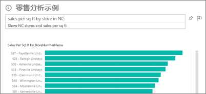
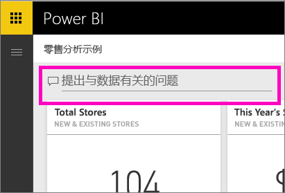
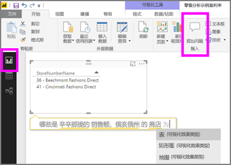

# Power BI 服务和 Power BI Desktop 中的 Power BI 问答
## “问答”是什么？
有时从你的数据中获得答案的最快方法是使用自然语言提问。 例如，“去年的销售总额是多少”。  使用“问答”来利用直观、自然的语言功能浏览数据并接收图表和图形形式的答案。 “问答”与搜索引擎不同 --“问答”仅提供有关 Power BI 中的数据的结果。

可以本文为起点，了解 Power BI 问答的方方面面。 请选择下面的链接，了解 Power BI 问答在 Power BI 服务（仪表板和报表）、Power BI Desktop（报表）、Power BI Embedded 和 Power BI 移动版中的工作原理。  

> [!NOTE]
> Power BI 问答仅支持回答用英文提问的自然语言查询。 你还可以尝试使用西班牙语提问的预览功能。 在“Power BI Desktop”中，转到“文件”>“选项和设置”>“选项”，查找“预览功能”选项卡。选中“问答的西班牙语支持”对应的框。  
>
>

提问仅仅是个开始。  在完善数据或扩展问题、发现可信的新信息、专注细节以及缩小以获得更宽广的视野的过程中找到乐趣吧。 你将会满意你的见解和发现。

体验是真正的交互式…并且快速！ 由内存存储提供支持，响应几乎瞬时完成。

##  面向使用者的 Power BI 问答
如果同事与你共享仪表板，将会在 Power BI 服务 (app.powerbi.com) 中的仪表板上、Power BI 移动版中的仪表板底部和 Power BI Embedded 中的可视化效果上方看到 Power BI 问答的提问框。 只有在所有者授予编辑权限后，才能使用 Power BI 问答浏览数据，但无法保存通过 Power BI 问答创建的任何可视化效果。

## 面向创建者的 Power BI 问答
若为 Power BI 报表的创建者，或拥有对数据集的编辑权限，将在 Power BI 服务中的仪表板上，以及在 Power BI 服务和 Power BI Desktop 中的每个报表页上看到 Power BI 问答的提问框。 使用 Power BI 问答创建的任何可视化效果都可以保存到仪表板和报表。

除了可以使用 Power BI 问答浏览数据之外，创建者和数据集所有者还能提升使用者的 Power BI 问答体验，具体是通过[修改数据集](service-prepare-data-for-q-and-a.md)、添加[特别推荐问题](service-q-and-a-create-featured-questions.md)，以及为本地实时连接数据集[启用和禁用 Power BI 问答](service-q-and-a-direct-query.md)。 在 [Embedded 方案](developer/qanda.md)中，开发人员可以在“交互式”和“仅结果”这两种模式之间进行选择。

## 问答如何知道怎样回答问题？
### 问答使用哪些数据集？
问答如何知道怎样回答特定于数据的问题？ 它依赖于基础数据集中的表、列和计算字段的名称。 因此你（或数据集所有者）对它们的称谓才最重要！

例如，假设你有这样一个 Excel 表，表名称为“销售”，其中列标题有“产品”、“月份”、“销售件数”、“销售总额”和“利润”。 你就可以对任何这些条目提问。  你可以请求提供“显示销售额”、“按月显示总利润”、“按销售件数对产品排序”等。

问答可以根据数据集的整理方式进行回答。 它对 Salesforce 中的数据如何处理？ 当连接到 salesforce.com 帐户时，Power BI 会自动生成一个仪表板。  当你使用问答开始提问时，请同时查看一下在仪表板可视化效果中显示的数据和在问答下拉列表中显示的数据。

* 如果可视化效果的轴标签和值包括“销售额”、“帐户”、“月份”和“商机”，则可以有把握地提出以下问题：“哪个帐户的商机最大”或“以条形图的形式按月显示销售额”。
* 如果下拉列表包括“销售人员”、“省/直辖市/自治区”和“年份”，则可以有把握地提出以下问题：“*2013* 年在美国佛罗里达州，哪个销售人员的销售额最低”。

如果可以通过 Google Analytics（Google 分析）获取网站性能数据，则可以向“问答”提出关于花在网页上的时间、独特网页访问数以及用户参与度方面的问题。 如果你要查询地理数据，则可以按位置就年龄和家庭收入提问。

### 问答使用哪些可视化效果？
问答会根据要显示的数据选取最佳的可视化效果。 有时，可将基础数据集中的数据定义为特定类型或类别，以帮助问答识别如何显示数据。 例如，如果数据被定义为日期类型，则该数据很有可能显示为线图。 如果将数据分类为城市，则很有可能显示为地图。

通过将可视化效果添加到你的问题，还可以告知“问答”要使用哪个可视化效果。 但请记住，“问答”并非总能显示你请求的可视化效果类型中的数据。

有关“问答”可识别的关键字的信息，请参阅[提问技巧](service-q-and-a-tips.md)。

## 有关 Power BI 问答的详细信息
[概述：如何在 Power BI 仪表板和报表中使用 Power BI 问答](power-bi-tutorial-q-and-a.md)：逐步介绍了如何使用 Power BI 问答，并概述了它的全部工作原理。

[Microsoft Power BI 移动版应用](mobile-apps-ios-qna.md)：适用于 iPad、iPhone 和 iPod Touch 设备上的 iOS。

[Microsoft Power BI Embedded](developer/qanda.md)：将 Power BI 问答合并到应用程序中。

[在“问答”中提问的提示](service-q-and-a-tips.md)：学习如何与“问答”交谈以获得可能的最佳结果。

[将精选问题添加到你的数据集](service-q-and-a-create-featured-questions.md)，“问答”将向你的同事推荐这些问题。

[为本地数据集启用 Power BI 问答](service-q-and-a-direct-query.md)：如需使用网关连接到数据集，请使用 Power BI 设置来启用和禁用 Power BI 问答。

[教程：通过“零售销售额示例”在 Power BI 服务中使用 Power BI 问答](power-bi-visualization-introduction-to-q-and-a.md)：在实际行业中使用 Power BI 问答的教程。

[将你的数据与“问答”很好地配合使用](service-prepare-data-for-q-and-a.md)：你是创建数据集和数据模型的人员吗？  那么本主题适合你。

更多问题？ [尝试参与 Power BI 社区](http://community.powerbi.com/)
