# 向 Power BI 服务报表添加筛选器（在“编辑视图”中）
> [!TIP]
> 我们建议先阅读[关于 Power BI 报表中的筛选器和突出显示](power-bi-reports-filters-and-highlighting.md)。

本文中的此示例展示 Power BI 服务。 不过这与 Power BI Desktop 中的步骤几乎完全相同。
> 
> 

## “编辑视图”和“阅读视图”中报表筛选器的区别是什么
可使用下列两种模式与报表交互：[阅读视图](consumer/end-user-reading-view.md)和[编辑视图](service-interact-with-a-report-in-editing-view.md)。  而筛选功能会根据你所用的模式来提供。

* 在“编辑视图”中，可以添加报表、页面和视觉对象筛选器。 保存报表时，筛选器将随之一起保存。 在“读取视图”中查看报表的人可以与你添加的筛选器交互。
* 在“读取视图”中，可以与报表中已存在的任意报表、钻取、页面和视觉对象筛选器交互，但不能添加新的筛选器。 但是，即使是在移动应用中查看报表，即使离开报表后返回，你在“筛选器”窗格中进行的更改也会随报表一起保存下列。  

> [!NOTE]
> 本文介绍了如何在报表“**编辑视图**”中创建筛选器。  有关“读取视图”中的筛选器的详细信息，请参阅[在报表“读取视图”中与筛选器交互](consumer/end-user-reading-view.md)。

## Power BI 筛选器窗格中可用的筛选器
不管使用 Desktop 还是 Power BI 服务，“筛选器”窗格都显示在报表画布的右侧。 如果未看到“筛选器”窗格，请选择右上角的“>”图标将其展开。

有四种类型的筛选器。

- **页面筛选器**可应用于报表页面上的所有视觉对象     
- **视觉对象筛选器**可应用于报表页面上的单个视觉对象    
- **钻取筛选器**可应用于报表中的单个实体    
- **报表筛选器**可应用于报表中的所有页面    

    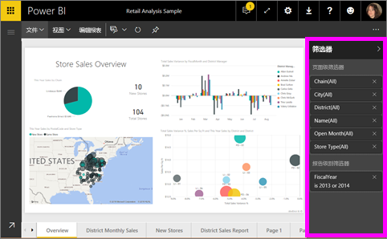

因为筛选器具有持久性，即当你离开报表时，Power BI 将保留你对筛选器、切片器和其他数据视图的更改。 所以当你返回报表时，可以从离开的位置继续。 如果不希望保留你对筛选器的更改，请选择顶部菜单栏中的“重置为默认值”。

## 向特定可视化效果添加筛选器（又称视觉筛选器）
有两种方法可以实现此目的： 

* 通过筛选可视化效果已在使用的字段
* 通过标识可视化效果尚未使用的字段，并将该字段直接添加到“视觉级筛选器”存储桶中。

### 通过筛选可视化效果中已有的字段
1. [在“编辑视图”中打开报表](consumer/end-user-reading-view.md)。
   
   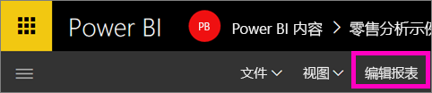
2. 打开“可视化效果和筛选器”窗格和“字段”窗格（如果尚未打开）。
   
   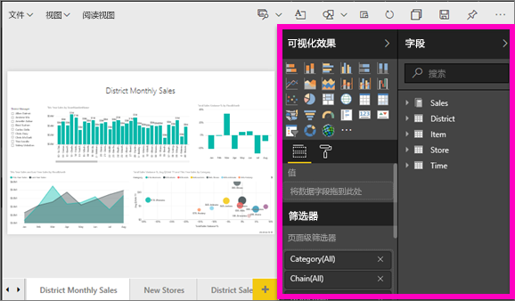
3. 选择视觉对象，将其激活。 视觉对象使用的所有字段在“字段”窗格已标识并在“筛选器”窗格中列出来（在“视级筛选器”标题下方）。
   
   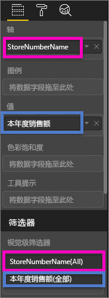
4. 此时将向可视化效果已在使用的字段添加筛选器。 
   
   * 向下滚动到“**视觉对象级筛选器**”区域，然后选择箭头以展开要筛选的字段。 在本示例中，将筛选“StoreNumberName”
     
      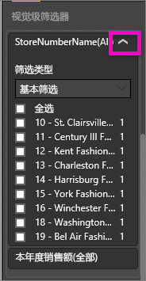 
   * 设置“基本”、“高级”或“前 N 个”筛选控件（请参阅[如何使用报表筛选器](consumer/end-user-report-filter.md)）。 在本示例中，将选择“基本”筛选并在数值 10 、11 、15 和 18 旁放置选中标记。
     
      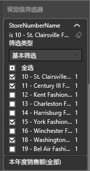 
   * 视觉对象会随新的筛选器而变化。 如果将报表与筛选器一起保存，则报表读者可以在“阅读视图”中通过选择或清除值的方式与筛选器交互。
     
      
5. 现在我们将一个全新的字段作为“视觉级筛选器”添加到可视化效果中。
   
   * 在“字段”窗格中，选择要添加为新视觉对象级筛选器的字段，然后将它拖到 **“视觉对象级筛选器”区域**中。  在本示例中，我们将“区域经理”拖动到“视觉级筛选器”存储桶并仅选中“Andrew Ma”。 
     
      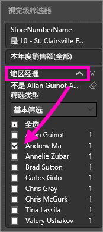
   * 请注意，“区域经理”*未*添加到可视化效果本身。 可视化效果仍由轴“StoreNumberName”和值“本年度销售额”组成。  
     
      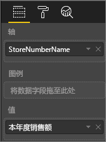
   * 此外，现在已将可视化效果本身筛选为仅显示 Andrew 本年度在指定商店的销售额。
     
     

## 向整个页面添加筛选器（又称页面视图筛选器）
1. [在“编辑视图”中打开报表](consumer/end-user-reading-view.md)。
2. 打开“可视化效果和筛选器”窗格和“字段”窗格（如果尚未打开）。
3. 在“字段”窗格中，选择要添加为新页面级筛选器的字段，然后将它拖动到“页面级筛选器”区域中。  
4. 选择要筛选的值，设置“基本”或“高级”筛选控件（请参阅[如何使用报表筛选器](consumer/end-user-report-filter.md)）。
   
   在此筛选器的影响下，将重新绘制页面上的所有可视化效果以反映更改。 
   
   

如果将报表与筛选器一起保存，则报表读者可以在“阅读视图”中通过选择或清除值的方式与筛选器交互。

## 添加钻取筛选器
通过在 Power BI 服务和 Power BI Desktop 中使用钻取，可以创建一个侧重于特定实体（如供应商、客户或制造商）的目标报表页。 现在，从其他报表页中，用户可以右键单击该实体的数据点并钻取到已设定焦点的页。

### 创建钻取筛选器
若要执行此操作，请在编辑视图中打开客户盈利率示例。 我们假设你需要一个侧重于管理层业务领域的页。   

1. 向报表中添加一个新页，并将其命名为“管理人员团队”。 这将是钻取目标页。
2. 添加可跟踪团队管理层业务领域的关键指标的可视化效果。    
3. 将“管理人员”>“管理人员名称”添加到钻取筛选器。    
   
    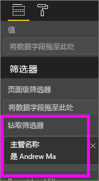
   
    请注意，Power BI 向报表页添加了一个后退箭头。  选择后退箭头可使用户返回到初始报表页，即他们选择进行钻取时所在的页。 后退箭头仅在阅读视图中可用。
   
     

### 使用钻取筛选器
让我们来看看钻取筛选器的工作原理。

1. 从“团队记分卡”报表页开始操作。    
2. 假设你是 Andrew Ma，并且你希望看到管理人员团队报表页仅筛选出你的数据。  从左上角区域图表中，右键单击任意绿色数据点打开钻取菜单选项。
   
    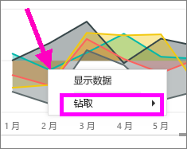
3. 选择“钻取”>“管理人员团队”钻取到名为“管理人员团队”的报表页。 在你是 Andrew Ma 的情况下，对该页进行筛选以显示有关右键单击的数据点的相关信息。 只有“钻取筛选器”框中的字段才会被传递到钻取报表页。  
   
    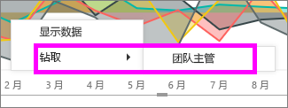

## 向整个报表添加筛选器（又称报表筛选器）
1. [在“编辑视图”中打开报表](consumer/end-user-reading-view.md)。
2. 打开“可视化效果和筛选器”窗格和“字段”窗格（如果尚未打开）。
3. 在“字段”窗格中，选择要添加为新报表级筛选器的字段，然后将它拖动到“报表级筛选器”区域中。  
4. 选择要筛选的值（请参阅[如何使用报表筛选器](consumer/end-user-report-filter.md)）。

    活动页面上的视觉对象与报表中所有页面上的视觉对象都会随新的筛选器而变化。 如果将报表与筛选器一起保存，则报表读者可以在“阅读视图”中通过选择或清除值的方式与筛选器交互。

1. 选择后退箭头返回到上一个报表页。

## 注意事项和疑难解答

- 某些情况下，视觉对象级别筛选器与页面级别筛选器会返回不同的结果。  例如，添加视觉对象级别筛选器时，Power BI 会筛选聚合结果。  默认聚合为“求和”，不过你也可以[更改聚合类型](service-aggregates.md)。  

    然而，添加页面级别筛选器时，Power BI 会在不聚合的情况下进行筛选。  这是因为页面可能有多个视觉对象，而且每个视觉对象可能使用不同的聚合类型。  因此，该筛选器会应用于每个数据行。

- 如果未看到“字段”窗格，请确保你处于报表[编辑视图](service-interact-with-a-report-in-editing-view.md)中    
- 如果对筛选器进行了大量更改，而希望返回报表作者的默认设置，请选择顶部菜单栏中的“重置为默认值”。

## 后续步骤
 [如何使用报表筛选器](consumer/end-user-report-filter.md)

  [报表中的筛选器和突出显示](power-bi-reports-filters-and-highlighting.md)

[在报表的“阅读视图”中与筛选器和突出显示交互](consumer/end-user-reading-view.md)

[更改报表视觉对象相互交叉筛选和交叉突出显示的方式](consumer/end-user-interactions.md)

更多问题？ [尝试参与 Power BI 社区](http://community.powerbi.com/)

